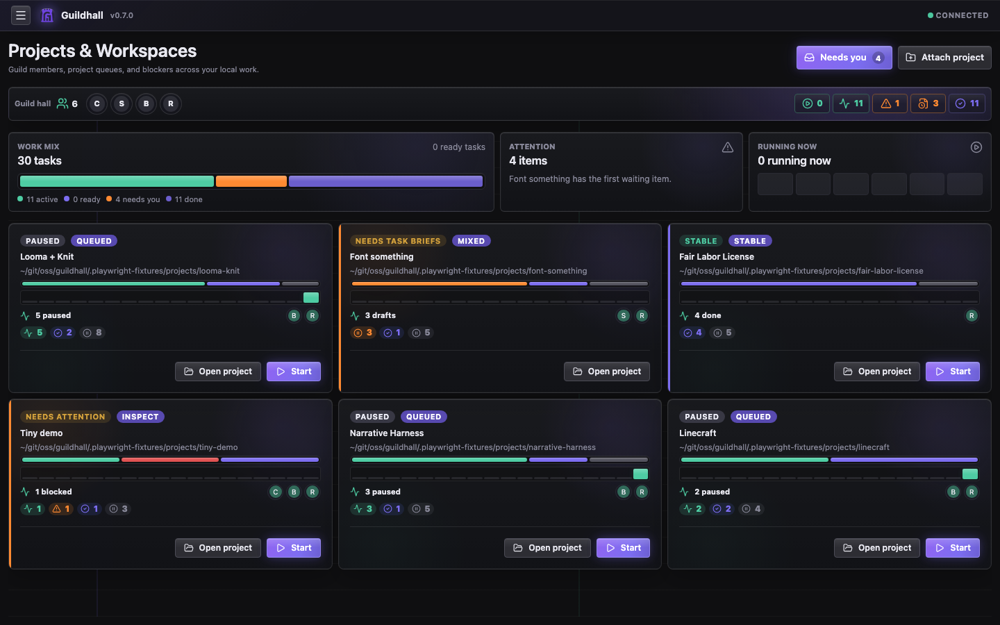
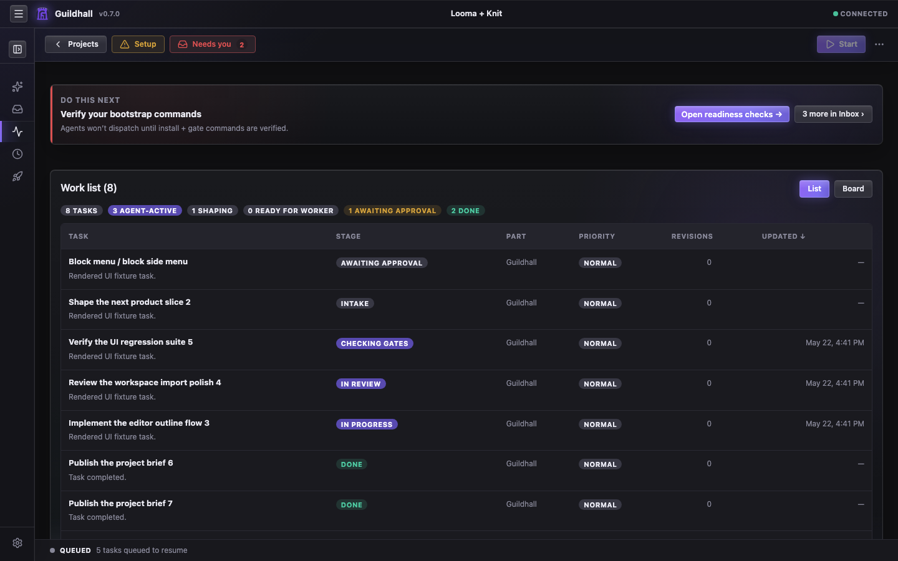

# Projects and work

Guildhall is easiest to understand once you see how projects and work relate.
The app starts at the service home, then narrows into the project shell where
project survey, task blueprints, live agent work, inspections, and release
readiness play out. It keeps the current state visible so you do not have to
hold the whole run in your head.

<picture class="gh-doc-picture">
  <source srcset="../assets/ui-audit/0-7-0/projects.avif" type="image/avif" />
  
</picture>

## What it does well

- **Service over projects**: Projects & Workspaces is not married to one repo. It runs as a local service and keeps multiple projects available from one place.
- **Current labels match the app**: the service row is **Guild hall** (the
  shared room for all registered projects), **Work mix**, **Attention**, and
  **Running now**; the project cards carry state chips such as **Paused**,
  **Queued**, **Needs task briefs**, **Mixed**, **Stable**, and **Inspect**.
- **Provider defaults are visible up front**: the home view shows the
  machine-default provider and worker model group before you open a project. If
  the preferred provider and the active model lane disagree, Guildhall keeps
  that warning visible and routes you to Providers instead of letting the run
  wander off with the wrong model.
- **Git health is part of project health**: cards and readiness signals can
  call out dirty repos, local commits, open PRs, and unresolved task worktrees.
  A project can look quiet in the task queue and still have a Git story that
  needs closing.
- **File-backed, not hidden**: the shared project plan lives in `./guildhall.yaml`,
  compact shared Guildhall state lives in committed `./.guildhall/` files,
  and local/private overrides live in
  `./.guildhall/config.yaml`. Machine-wide state such as the registry and
  provider credentials lives in `~/.guildhall/`; raw transcripts and bulky run
  history live under `~/.guildhall/data/projects/`. The UI is a clearer window
  into those files, not a secret second database.
- **One operating place**: the service home gets you into the right project, and the shell carries the detailed state without feeling like a separate product.
- **Memory you can inspect**: Settings -> Memory shows project habits, cross-project preferences, project playbooks, and Guildhall product ideas without adding a new approval step to every task.

## Most of the real loop lives in the browser

- **Attach and configure**: bring a project into the service, choose a provider path, and get the shell ready for real work.
- **Shape and launch tasks**: create work, review the blueprint, answer the awkward questions, then hit **Start** when the task is ready to move.
- **Pressure-test broad asks**: a release or feature request can become a
  one-question-at-a-time intake instead of a giant vague task. Answers,
  assumptions, and deferrals stay attached to the project.
- **Inspect the run**: read the queue, open the drawer, follow the transcript, and decide whether Guildhall is making durable progress or just generating noise.
- **Judge release readiness**: keep reviewer verdicts, release checks, and Git
  Story blockers visible so “probably fine” does not become your deployment
  methodology.
