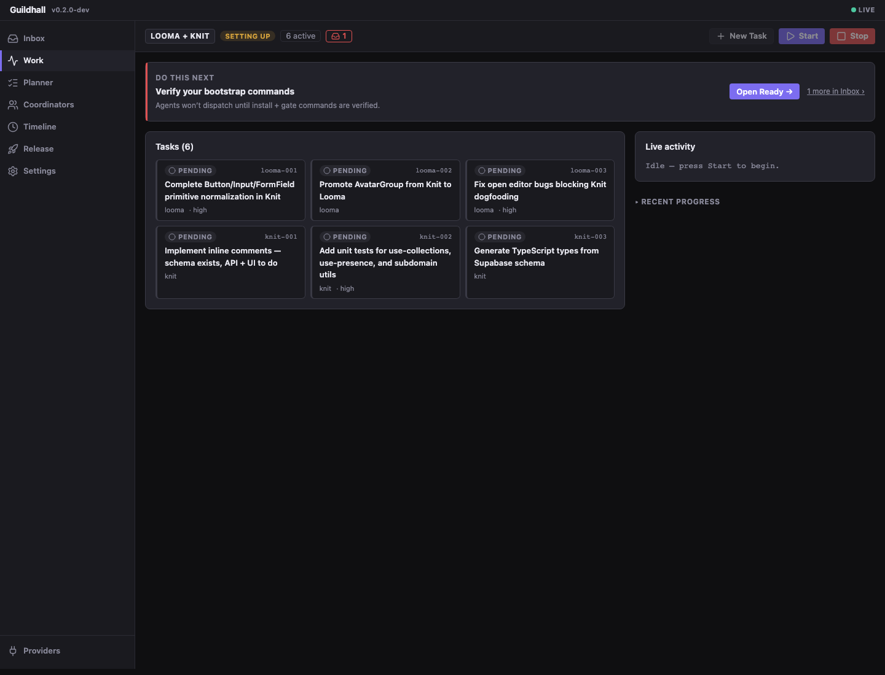

# The dashboard is where the state becomes readable

Guildhall is easiest to understand once you see the shell. The browser
experience starts at the service home, then narrows into the project shell
where setup, task intake, live progress, reviewer calls, and release
readiness actually play out. It tries very hard not to make you remember more
than you should.

## What it does well

- **Service over projects**: the dashboard is not married to one repo. It runs as a local service and keeps multiple projects available from one place.
- **File-backed, not hidden**: project state still lives in `guildhall.yaml`, `.guildhall/config.yaml`, and `memory/*`, while machine-wide state such as the registry and provider credentials lives in `~/.guildhall/`. The UI is a clearer window into that state, not a secret second database.
- **One operating surface**: the service home gets you into the right project, and the shell carries the detailed state without feeling like a separate product.
- **Learning you can inspect**: Settings -> Learning shows project habits, cross-project preferences, project playbooks, and Guildhall product ideas without adding a new approval step to every task.

## Most of the real loop lives in the browser

- **Attach and configure**: bring a project into the service, choose a provider path, and get the shell into a state where the guild can work without tripping over setup debris.
- **Shape and launch tasks**: create work, review the draft, answer the awkward questions, then hit **Start** when the task is ready to move.
- **Inspect the run**: read the queue, open the drawer, follow the transcript, and decide whether the guild is making progress or just generating noise.
- **Judge release readiness**: keep reviewer verdicts and release checks visible so “probably fine” does not become your deployment methodology.
