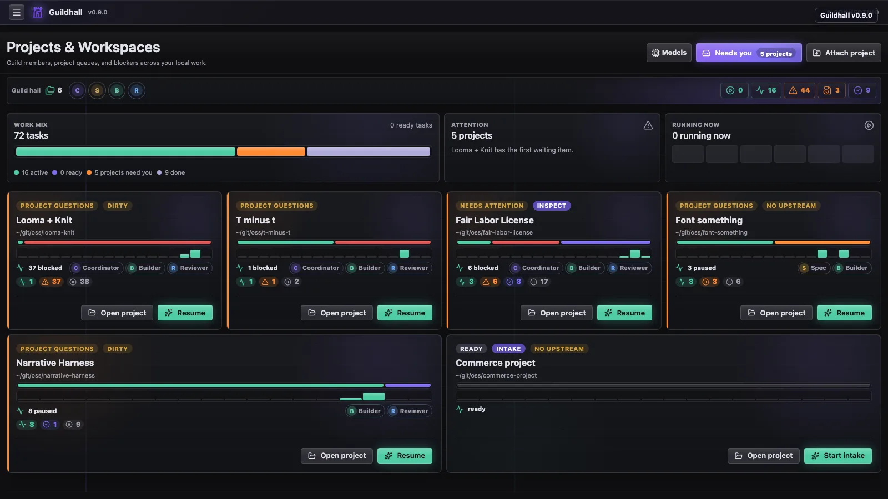
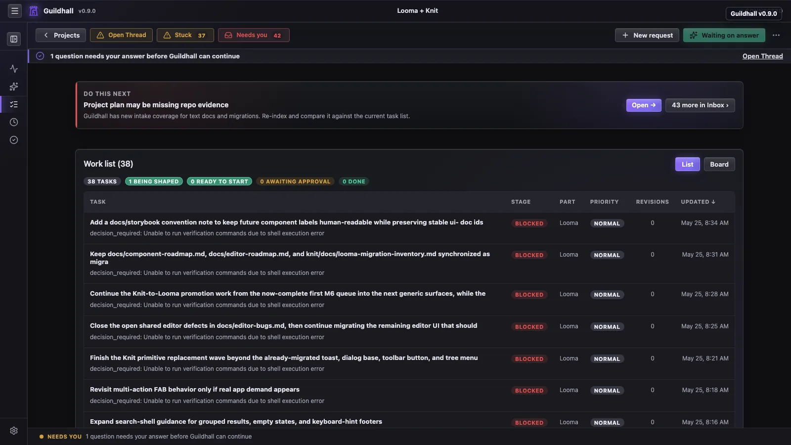

# Projects and work

Guildhall is easiest to understand once you see how projects and work relate.
The app starts at the service home, then narrows into the project shell where
project survey, task blueprints, live agent work, inspections, and release
readiness play out. It keeps the current state visible so you do not have to
hold the whole run in your head.

<picture class="gh-doc-picture">
  
</picture>

## What stays visible

The projects page is the lobby. It helps you pick the right project, notice
anything risky, and get into the work without spelunking through files first.

- **Project state**: cards show whether a project is paused, queued, stable,
  mixed, or waiting for inspection.
- **Provider readiness**: the home view shows the default provider and worker
  model group before you open a project. If the choices disagree, Guildhall
  sends you to Providers before the wrong model starts working.
- **Git health**: dirty repos, local commits, open PRs, and unresolved task
  worktrees stay part of the project story.
- **Start blockers**: migrations, unanswered questions, runtime setup, and
  provider mismatches explain themselves before you press **Start**.

Inside a project, the shell keeps the main rooms separate:

- **Thread** is the conversation.
- **Needs You** is the alert queue.
- **Structure** is the repo map, project graph, and shared-contract view.
- **Settings** is readiness, providers, identity, profiles, and configuration.

That split keeps the UI from turning every useful signal into another task
card. Cross-project work can live in the project graph. Owner decisions can
stay linked to the same Thread session. Memory can be inspected in Settings
without adding a new approval step to every task.

Guildhall is file-backed too. The shared project plan lives in
`./guildhall.yaml`, compact shared state lives in committed `./.guildhall/`
files, and local/private overrides live in `./.guildhall/config.yaml`.
Machine-wide state such as the registry and provider credentials lives in
`~/.guildhall/`; bulky run history lives under
`~/.guildhall/data/projects/`. The UI is a clearer window into those files,
not a secret second database.

## Most of the real loop lives in the browser

- **Attach and configure**: bring a project into the service, choose a provider path, and get the shell ready for real work.
- **Shape and launch tasks**: create work, review the blueprint, answer the awkward questions, then hit **Start** when the task is ready to move.
- **Pressure-test broad asks**: a release or feature request can become a
  one-question-at-a-time intake instead of a giant vague task. Answers,
  assumptions, and deferrals stay attached to the project.
- **Review project structure**: inspect the structural map, project graph,
  shared contract questions, and provider work from Structure.
- **Inspect the run**: read the queue, open the drawer, follow the transcript,
  and decide whether Guildhall is making useful progress.
- **Judge current work closure**: keep reviewer verdicts, closure checks, and
  Git Story blockers visible so “probably fine” does not become the standard.
