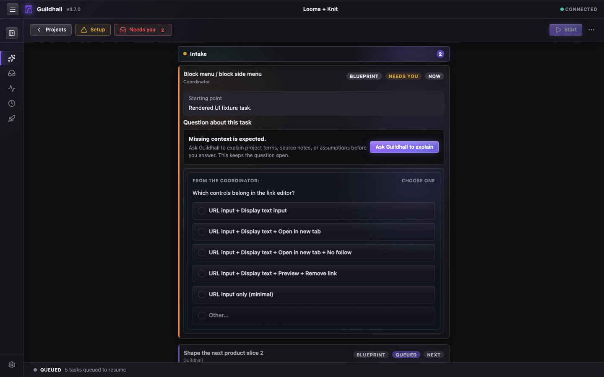

# Start here

Guildhall is a local app for handing real project work to AI helpers without
losing the plot. It keeps the plan, the work, the review, and the blockers in
one visible place. You do not need to learn the internal machinery before your
first run.


## The first mental model

Think of Guildhall as a small construction office for software:

- **Projects** are your repos.
- **Blueprints** are the accepted plans for what gets built and how it
  will be checked.
- **Tasks** are framed pieces of work that can move through the guild.
- **The guild** is the set of helpers that plan, build, inspect, and report.
- **The shell** is the browser screen where you can see the job site.

The goal of getting started is simple: open one project, give it one small
task set, and see whether the work moves with clear evidence. Read
[How Guildhall builds](./how-guildhall-builds) when you want the full mental
model.

Setup stays short. Guildhall can infer routine defaults, recommend a path,
and save your attention for choices that change what you are building or how
safe the run will be.

## Install

```bash
curl -fsSL https://raw.githubusercontent.com/matthew-dean/guildhall/main/scripts/install.sh | sh
```

If you prefer npm and already have Node.js 20 or newer:

```bash
npm install -g guildhall
```

The installer downloads the latest macOS package from GitHub Releases and
checks `guildhall-macos.tar.gz.sha256` before installing. To pin a release:

```bash
curl -fsSL https://raw.githubusercontent.com/matthew-dean/guildhall/main/scripts/install.sh | GUILDHALL_VERSION=0.7.0 sh
```

## Open one project

```bash
cd ~/projects/my-app
guildhall serve
```

Guildhall opens the browser. If this is the first time the repo has been
opened, the setup wizard asks for the basics: the project name, a stable URL
slug, and which model provider to use. That is the first site survey: where is
the project, what is it called, and can Guildhall work safely?



## What Guildhall may ask

Guildhall does not need you to design the whole project before it can move. On
the first run, the questions usually fall into a few small buckets.

### Project identity

These are setup questions, not product questions:

> **Project name:** What is this project called in Guildhall?

Good answer:

> `Acme Billing Portal`

> **Project slug:** What stable URL slug will Guildhall use?

Good answer:

> `acme-billing-portal`

The slug keeps project URLs stable. A browser tab for one project must never
quietly turn into another project. That way lies comedy, and not the good kind.

### Project direction

If the repo is new or stale, Guildhall may summarize what it knows and ask
what to add or correct:

> I found a Next.js app with auth scaffolding, a README about invoices, and no
> accepted project direction yet. What is this project trying to become?

A useful answer is short and product-shaped:

> This is a self-serve billing portal for small B2B customers. The first goal is
> account login, invoice history, and payment-method updates. Do not work on
> pricing plans or admin tools yet.

You do not need to pick a database, component library, or folder structure
unless that choice is part of the product direction. Guildhall can usually read
the repo and follow the local pattern.

### Existing notes and imports

For an existing repo, Guildhall may find README sections, TODO files, roadmap
notes, or old planning docs:

> I found possible work in `README.md`, `docs/roadmap.md`, and `TODO.md`.
> Which source becomes task drafts?

Useful answers:

> Use `docs/roadmap.md` first. Treat `TODO.md` as scratch notes.

> Ignore the old README checklist. The current source of truth is
> `docs/release-plan.md`.

This does not mean every note becomes runnable work. It means Guildhall can
turn selected notes into draft task blueprints for review.

### Task shaping

Before a worker starts, Guildhall may ask about scope or success:

> Does password reset belong in this auth task, or is it a separate task?

Useful answers:

> Separate task. This one only makes login/register work with existing
> email confirmation.

> Include it, but only if the repo already has the email provider configured.

It may also ask:

> What counts as done?

Useful answer:

> A user can register, confirm email, log in, log out, and see the dashboard.
> Add or update tests for those paths. Do not build profile management yet.

If you are not sure what Guildhall is asking, say that. A good follow-up is:

> I do not know what this refers to. Show me the source note and your current
> assumption.

Guildhall keeps the question open and gives you the missing context instead of
treating that reply as the final answer.

### Runtime blockers

Once work starts, questions get very concrete:

> The repo is dirty. These files were changed by an earlier Guildhall run.
> Package them into a task checkpoint before continuing?

> `pnpm build` fails because `pixi` is missing. Install it and retry, or mark
> the readiness check blocked?

> The worker completed the code path, but the reviewer found no verification
> command. Run the focused test, or move back to implementation?

Good blockers tell you:

- what happened
- what evidence Guildhall has
- what choice is needed
- what Guildhall recommends

If a blocker only says "Needs you" without context, that is a product problem,
not a puzzle you were supposed to solve with vibes.

## A first-run example

Here is what a healthy first run feels like.

1. You run `guildhall serve` inside `~/projects/my-app`.
2. Guildhall asks for a project name, slug, and provider.
3. Guildhall summarizes what it found:

   > I found a Vite app, a README describing a dashboard, and TODO notes about
   > auth and settings. No accepted task blueprints yet.

4. You add direction:

   > First release is a private dashboard for the internal team. Focus on auth,
   > navigation, and one useful settings page. Do not build billing yet.

5. Guildhall drafts starter blueprints:

   - `Set up auth shell`
   - `Add dashboard navigation`
   - `Create settings page placeholder`

6. You approve one blueprint or narrow it:

   > Approve auth shell, but password reset is out of scope.

7. You press **Start**.
8. Thread shows visible motion: task state changes, live events tick, transcript
   notes appear, verification runs, and reviewer/gate results attach to the
   same task.
9. If work stops, the blocker names the specific reason and the next choice.

That is the feeling to look for: one project, one visible queue, one task state,
and enough evidence that you can tell whether Guildhall is working or waiting.

## Choose your path

Use the path that matches your repo:

- [New project](./new-project): start from an empty or early repo.
- [Existing project](./existing-project): attach a repo that already has plans, docs, or TODOs.

Then read [First task set](./first-tasks) before pressing **Start**. A good
first run is small enough to watch, concrete enough to verify, and framed well
enough that the worker is not inventing the plan while building.

## What success looks like

After you start a project, the app shows motion:

- task status changes
- live events appear
- transcripts and review notes accumulate
- blockers explain what stopped and what needs your answer

If the button flips back and nothing visible changed, that is not a good run.
It is a setup problem, a product bug, or a task that needs more information.
