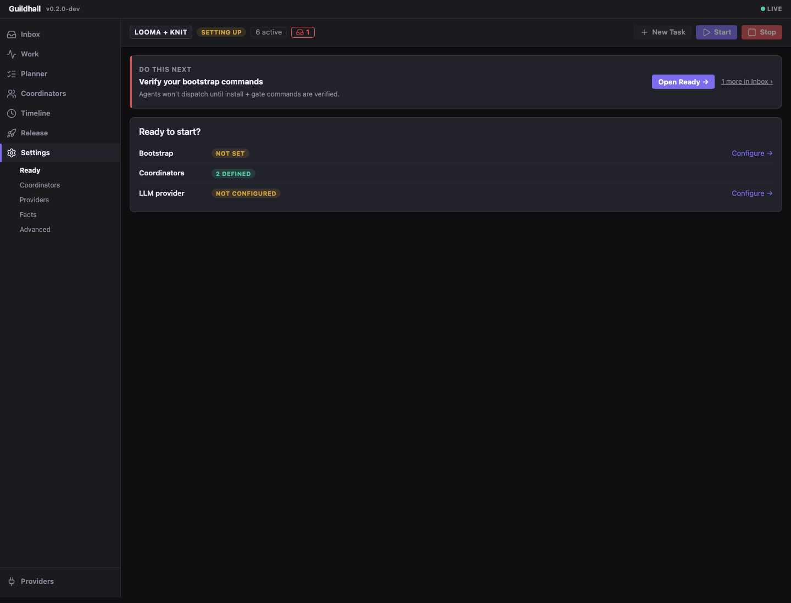

# Start the service. Open the project. Give it work.

The short version: install Guildhall, start it from the project you care
about, choose a provider, and hand the system one real piece of work. Then
keep the shell open and inspect the receipts instead of trying to remember
them.



## What you need

- `git` on your `PATH`
- One provider path: Claude Code CLI, Codex CLI, a local model server, or an Anthropic/OpenAI-compatible API key

## 1. Install Guildhall

You do not need to install it inside every repo. Guildhall runs as a local
service over your project folders.

```bash
curl -fsSL https://raw.githubusercontent.com/matthew-dean/guildhall/main/scripts/install.sh | sh
```

That installer drops in the bundled Guildhall runtime, including its own Node
binary on macOS, so you do not need to pre-install Node for the default path.

If you would rather install from npm instead:

```bash
npm install -g guildhall
```

That path does require Node.js 20 or newer.

## 2. Start it from the project folder

```bash
cd ~/projects/my-app
guildhall serve
```

That starts the local service, opens the browser, and usually drops you into
either the project shell or the setup wizard for that folder.

## 3. If the project is new, finish setup

If the folder already has `guildhall.yaml`, Guildhall opens the shell and you
can skip ahead.

If not, the setup flow gets you upright:

1. **Identity** - name and slug the project.
2. **Provider** - choose how the guild calls models.
3. **Launch** - either run meta-intake so Guildhall drafts the first policy pass, or skip to the shell and configure it by hand.

Meta-intake is there to reduce setup thrash, not to make choices in the dark. You still approve what lands in `memory/agent-settings.yaml`.


## 4. Hand the guild a task

1. Open the project shell.
2. Create a task from the Work or Thread surface.
3. Describe the outcome you want in plain language.
4. Let Guildhall shape, review, and route the work before you hit **Start**.

## 5. Keep the receipts

The point is not “walk away forever.” The point is that when you do step back in, the queue, transcripts, blockers, and reviewer calls are already laid out for you.

```bash
# reopen the browser surface later
guildhall serve

# or keep the daemon in the background
guildhall start
guildhall open
guildhall stop
```

## Where state lives

```text
<project root>/
├─ guildhall.yaml
├─ .guildhall/config.yaml
└─ memory/
   ├─ TASKS.json
   ├─ agent-settings.yaml
   ├─ sessions/
   └─ transcripts/
```

Machine-global state lives separately under `~/.guildhall/`, including the
project registry and shared provider credentials in `providers.yaml`.

## Next stops

- [Dashboard guide](./dashboard) for the actual operating surface
- [Onboarding and levers](./onboarding-and-levers) for the first policy pass
- [Project view](../web-ui/project-view) for the shell anatomy
- [CLI](../cli/) when you want the terminal path
