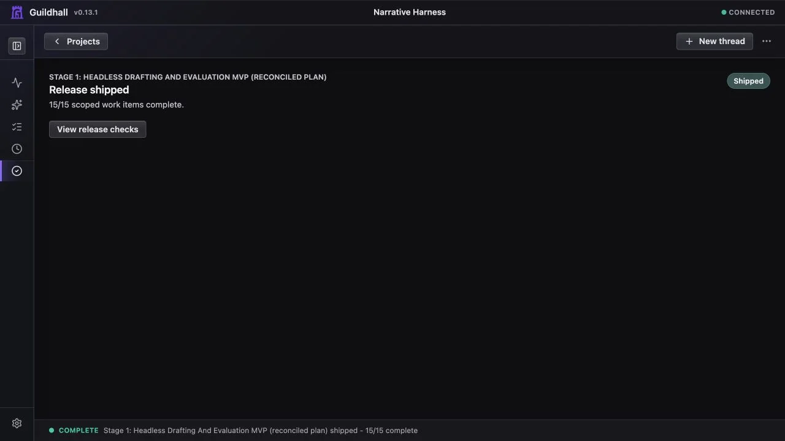

# Ship a release

A Guildhall project can keep growing. A release is the smaller promise you can
finish: a named set of work, its proof, and its repository landing state.

The whole job is:

1. Select the release.
2. Confirm what is included and what is later.
3. Run and review the included work.
4. Clear the release checks.
5. Ship.
6. Select another release only when you are ready.

## Select the release

Open **Project -> Map** and find **Release roadmap**. Select the release you want
Guildhall to treat as current.

Selection matters. Release, Overview, Work, Thread, and the task drawer all use
that saved scope. Work marked **Later** stays visible, but it does not block the
selected release.

Before starting work, check the included and later counts. If the boundary is
wrong, fix the release membership first. Do not use **Ship release** as the
moment to discover that the wrong work was selected.

## Run the included work

Use **Work** for the selected scope and **Threads** for questions, briefs, and
spec approvals. Guildhall can run implementation and checks, but it does not
silently approve work that is waiting for your judgment.

A release cannot become ready while included work is unfinished, waiting for an
approval, missing required proof, or blocked by a required project check.

## Read the release verdict

Open **Release**. The first view gives one answer and one next action.

- **In progress** means included work is still moving.
- **Needs you** means an approval or decision is waiting.
- **Blocked** means Guildhall can name a concrete condition that prevents
  shipping.
- **Ready** means the saved release state and current checks agree that the
  release can ship.
- **Shipped** means the release is closed. Later project changes do not reopen
  it.

Open **Checks** for the evidence behind the verdict. This includes unfinished
work, approvals, proof, design-system review when UI work requires it, and
repository state.

Overview and the project header use the same saved verdict. They may link you
to Release, but Release does not invent another action once you arrive. If the
release is shipped, every surface treats it as a receipt rather than reopening
old setup, approval, or repository warnings.

## If a refresh fails

A temporary API or provider failure should not replace the project with a
blank page. Guildhall keeps the last known project state visible, shows that it
could not refresh, and offers **Try again**. Treat the visible data as cached
until that warning clears; do not approve or ship from an error-only screen.

## Resolve repository follow-up

Repository follow-up means the work may be complete, but its checkout story is
not settled yet. Release can show changed files, local commits, branches without
an upstream, pending pull requests, skipped merges, or task worktrees that still
need a decision.

Use the action shown beside the repository finding. Depending on the state, that
usually means committing the work, pushing the branch, opening or merging the
pull request, or explicitly recording that the residue is local-only or
deferred.

Repository diagnostics explain why the current release cannot ship. They do not
reopen a release that is already recorded as shipped.

## Ship

When Release says **Ready**, choose **Ship release**. Guildhall performs a final
live check before recording the release as shipped. If that check finds a new
problem, the release stays open and the page shows the condition to resolve.

After shipping, the first view becomes a receipt: **Release shipped**, the
completed count, and no required next action.

## Release evidence

The publisher checks the release note, the immutable docs snapshot, and fresh
installed-app screenshots before it creates the package. The notes tell people
what changed; the snapshot preserves the documentation that shipped; the
screenshots show the owner path that was actually tested.

That check runs again in the tagged release workflow. A release cannot quietly
lose its explanation or its visual proof between a local publish and the
artifact that people install.

## Start the next release

Shipping does not close the project. When another planned release exists, return
to **Project -> Map -> Release roadmap** and select it. That is an optional new
cycle, not unfinished work from the release you just shipped.

If no later release exists, there is nothing else Guildhall needs you to do.
