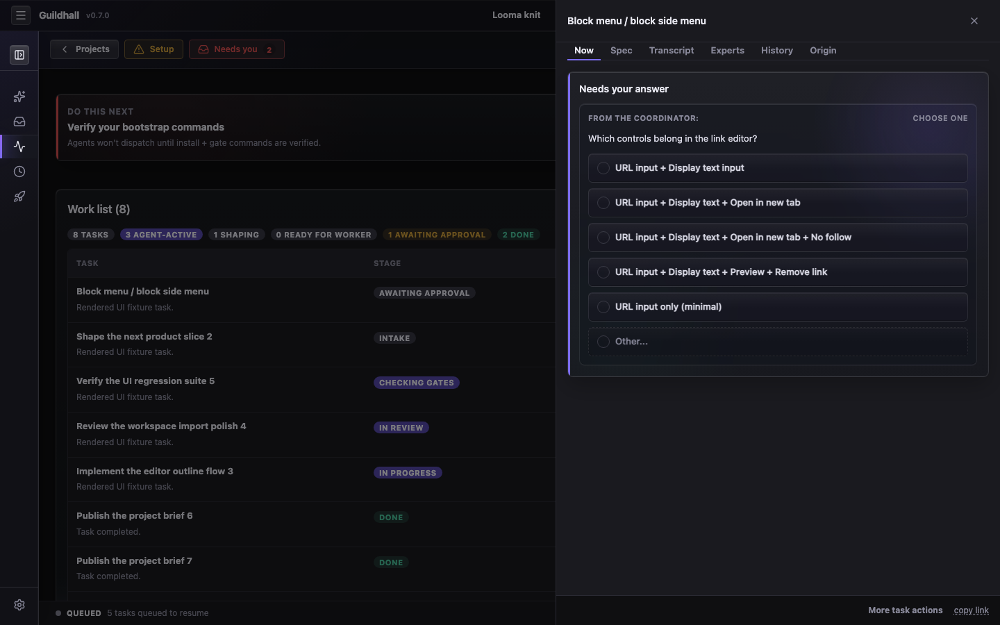

# Task drawer

The task drawer is the inspection surface for one task. Open it when a card is
too compressed to explain itself, or when you need to understand why Guildhall
believes a task is ready, blocked, rejected, or done.

## What it keeps together

- **Now**: current handoffs, questions, live work, or resume actions when a task has live context.
- **Spec**: intent, acceptance criteria, and gates.
- **Transcript**: what the agent actually said and did.
- **Experts**: applicable guilds and reviewer feedback.
- **History**: status changes, review verdicts, escalations, and gate outcomes.
- **Provenance**: the project policies and lever positions that shaped the task.

## When something is stuck

The drawer should collapse the useful evidence into one place: recent reviewer
rejections, failed gate output, escalation text, and the next decision
Guildhall needs from you. The goal is to avoid turning every blocker into a
forensics exercise.

For implementation-level details, see the [Task drawer UI reference](/web-ui/task-drawer).
