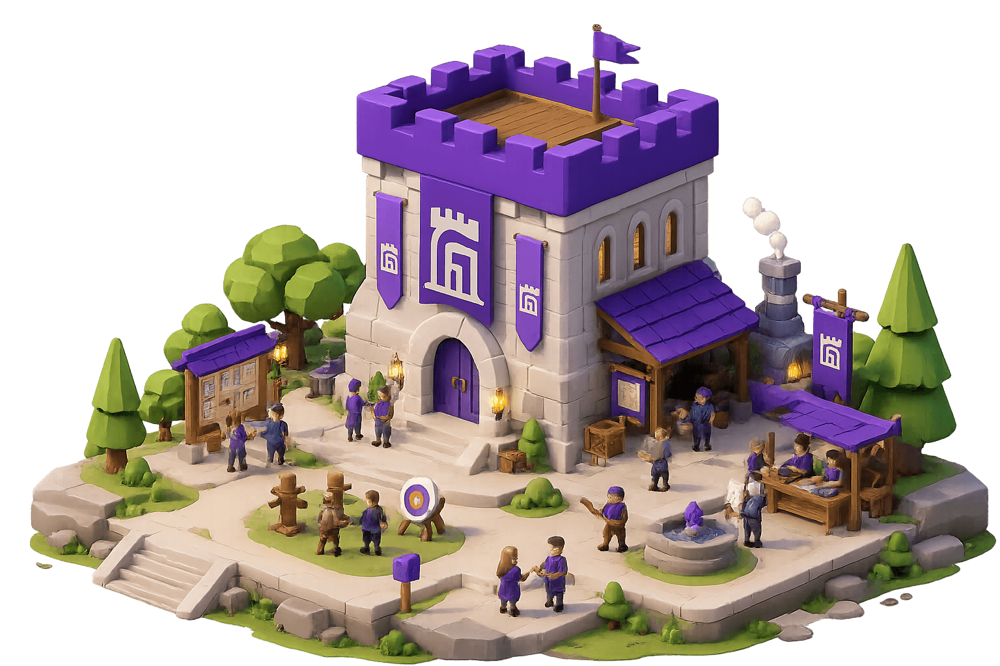

<section class="gh-home">
  <section class="gh-home-hero">
    

      
AI agents for real software work.

      <h1>Give AI agents a job site,not just a chat box.</h1>
      
Plan the task. Run the agents. Review the evidence. Recover when work gets stuck.

      <ul class="gh-home-proof-list" aria-label="Guildhall use cases">
        <li>Feature slices, cleanup passes, docs alignment, and release prep.</li>
        <li>Visible tasks, blockers, transcripts, reviews, and gates.</li>
        <li>Enough structure to keep AI work from drifting into chat fog.</li>
      </ul>
      

        

          <a class="gh-cta gh-cta-primary" href="/guildhall/guide/quick-start">Get started</a>
          <a class="gh-cta gh-cta-secondary" href="/guildhall/guide/introduction">How it works</a>
          <a class="gh-cta gh-cta-secondary" href="https://github.com/matthew-dean/guildhall">GitHub</a>
        

        
Current docs: <a href="/guildhall/releases/0.6.0">0.6.0</a>. Preview <a href="/guildhall/next/guide/">Next</a>.

        <ul class="gh-home-hero__badges" aria-label="Guildhall strengths">
          <li>Shared agent state</li>
          <li>Blueprints before changes</li>
          <li>Reviews before done</li>
        </ul>
      

    

    

      
    

  </section>

  <section class="gh-doc-section">
    

      
Why use it?

      <h2>Because AI work gets better when the project has a shape.</h2>
    

    

      <article class="gh-signal-card">
        <h3>For software developers</h3>
        
Hand off bounded work without losing architecture, tests, or review discipline. Guildhall nudges agents toward existing code, shared components, focused verification, and visible evidence.

      </article>
      <article class="gh-signal-card">
        <h3>For product-minded builders</h3>
        
Explain the product clearly, then let Guildhall turn that intent into smaller task blueprints. You can answer scope and taste questions without pretending to be the compiler.

      </article>
      <article class="gh-signal-card">
        <h3>For messy real projects</h3>
        
Keep work from scattering across chats, half-runs, and “wait, what did it change?” moments. Guildhall keeps the trail attached to the task.

      </article>
    

  </section>

  <section class="gh-origin-band">
    
Guildhall borrows its name from a shared room for skilled work: different trades, common standards, visible progress. That is the product promise, minus the dust.

  </section>

  <section class="gh-doc-section">
    

      
The core idea

      <h2>An agent harness wraps the model with workflow.</h2>
      
A chat assistant answers a conversation. An agent harness decides what work exists, what context each agent gets, which tools are allowed, when review happens, and when the run should pause for you.

    

    

      <article class="gh-signal-card">
        <h3>Plan</h3>
        
Turn broad intent into a blueprint: goal, scope, non-goals, acceptance criteria, and checks.

      </article>
      <article class="gh-signal-card">
        <h3>Build</h3>
        
Give workers focused context so they can make changes that fit the project instead of inventing a parallel universe.

      </article>
      <article class="gh-signal-card">
        <h3>Inspect</h3>
        
Use reviewers and gates to attach findings, command output, and release evidence before calling work done.

      </article>
    

  </section>

  <section class="gh-doc-section">
    

      
First steps

      <h2>Read just enough, then try one small task.</h2>
      
The best first run is intentionally modest: one project, one task, one visible path from idea to review.

    

    

      <article class="gh-limit-card">
        <h3>Start here</h3>
        <ul>
          <li><a href="/guildhall/guide/introduction">What Guildhall is</a></li>
          <li><a href="/guildhall/guide/quick-start">Install and open one project</a></li>
          <li><a href="/guildhall/guide/concepts">Core concepts glossary</a></li>
        </ul>
      </article>
      <article class="gh-limit-card">
        <h3>Then choose a path</h3>
        <ul>
          <li><a href="/guildhall/guide/new-project">New project</a></li>
          <li><a href="/guildhall/guide/existing-project">Existing project</a></li>
          <li><a href="/guildhall/guide/first-tasks">First task set</a></li>
        </ul>
      </article>
    

  </section>
</section>
