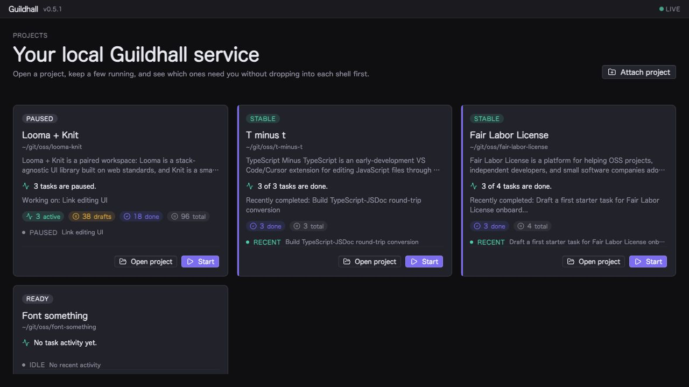
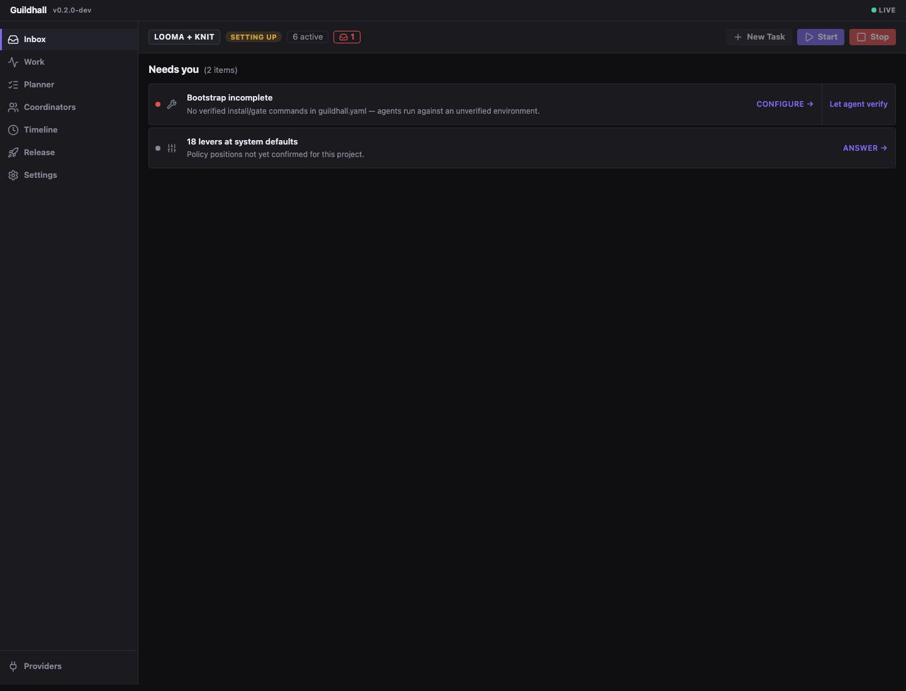
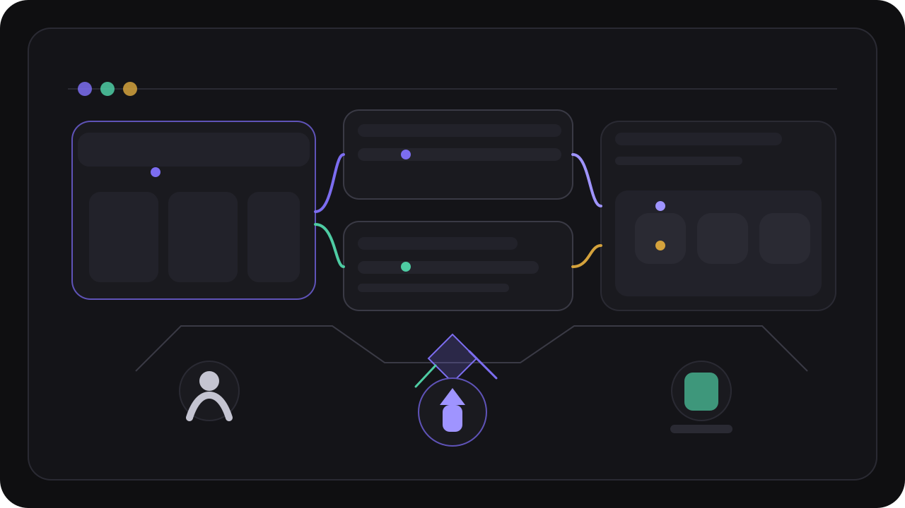
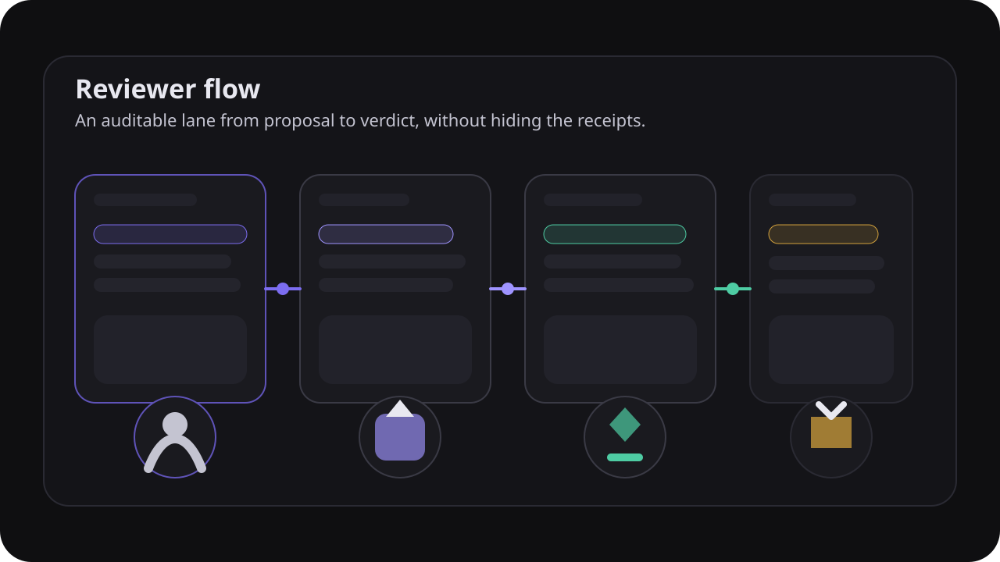

<section class="gh-home">
  <section class="gh-home-hero">
    

      
Local service. Visible state. Fewer things to remember.

      <h1>Let the guild carry the work.</h1>
      
As unattended as you want. As auditable as you need.

      
Guildhall runs over your projects from a local service. Queue state, reviewer calls, and transcripts stay attached to the work so you can let it run, step in when needed, and still understand what happened.

      

        

          <a class="gh-cta gh-cta-primary" href="/guildhall/guide/quick-start">Get started</a>
          <a class="gh-cta gh-cta-secondary" href="/guildhall/guide/new-project">New project</a>
          <a class="gh-cta gh-cta-secondary" href="/guildhall/guide/existing-project">Existing project</a>
          <a class="gh-cta gh-cta-secondary" href="https://github.com/matthew-dean/guildhall">Read the code</a>
        

        <ul class="gh-home-hero__badges" aria-label="Guildhall strengths">
          <li>Visible queue and blockers</li>
          <li>Reviewer verdicts with receipts</li>
          <li>Inspectable guardrails</li>
        </ul>
      

    

    

      <figure class="gh-doc-shot">
        <picture>
          <source srcset="./assets/ui-audit/projects.avif" type="image/avif" />
          
        </picture>
        <figcaption>
          <strong>The service starts with your projects.</strong>
          Open the shell that needs attention, start another run, or attach a new repo without guessing which hidden session is active.
        </figcaption>
      </figure>
      

        
What this buys you

        <h2>Less babysitting. More legible runs.</h2>
        <ul>
          <li>Run work from a real project surface instead of juggling hidden session state.</li>
          <li>Keep reviewer calls and transcripts close enough to challenge.</li>
          <li>Turn autonomy up or down without handing your judgment to a mystery box.</li>
        </ul>
      

    

  </section>

  <section class="gh-doc-section">
    

      
Actual product

      <h2>Real state, early in the story.</h2>
      
Guildhall earns trust by putting the moving parts where you can see them. Setup, task flow, release readiness, and the drawer full of evidence are part of the product.

    

    <figure class="gh-doc-shot">
      
      <figcaption>
        <strong>Real product, real state.</strong>
        Thread, queue, and the human inbox stay close enough together that you can see whether the next move belongs to the service or to you.
      </figcaption>
    </figure>
  </section>

  <section class="gh-origin-band">
    
Guildhall was built by an ADHD engineer who got tired of AI harnesses that expected him to keep twelve tabs, three half-runs, and one fragile mental thread alive at all times.

  </section>

  <section class="gh-doc-section">
    

      
Why it works

      <h2>Autonomy without amnesia.</h2>
      
The goal is not to feel magical. The goal is to carry real work while keeping the state legible enough that you can trust a good run and catch a bad one early.

    

    

      <article class="gh-signal-card">
        <h3>Reviewers with teeth</h3>
        
Work does not become done because a worker sounded confident. It becomes done because reviewers, checks, and release rules agree it can move forward.

      </article>
      <article class="gh-signal-card">
        <h3>Guardrails, not guesses</h3>
        
Bootstrap checks, environment checks, and release gates make it harder for the system to quietly plow through a broken setup and call it initiative.

      </article>
      <article class="gh-signal-card">
        <h3>Visible transcripts</h3>
        
When the guild does something strange, you can read the transcript instead of staring at a spinner and reconstructing the plot from vibes.

      </article>
      <article class="gh-signal-card">
        <h3>Levers, not vibes</h3>
        
Autonomy, reviewer strictness, remediation behavior, and fanout live in named settings instead of whatever mood the tool woke up in.

      </article>
      <article class="gh-signal-card">
        <h3>Memory with receipts</h3>
        
Project habits, cross-project preferences, and product suggestions stay inspectable, reversible, and scoped to the layer where they belong.

      </article>
      <article class="gh-signal-card">
        <h3>Visible state</h3>
        
The queue, blockers, and release posture stay legible. Hidden state is funny only until it ships.

      </article>
    

  </section>

  <section class="gh-doc-section">
    

      
Personalities, not pageantry

      <h2>The guild has character because the work does.</h2>
      
Coordinators, workers, specialists, and reviewers each carry a different job and point of view. That personality is there to sharpen decisions and reduce cognitive load, not to turn the product into theater.

    

    

      <figure class="gh-guild-figure gh-guild-figure-primary">
        
      </figure>
      

        <article class="gh-guild-copy">
          <h3>Different roles, different instincts</h3>
          
The coordinator routes, workers push, reviewers doubt, and gates insist on evidence. That is the useful personality in the system.

        </article>
        <figure class="gh-guild-figure gh-guild-figure-secondary">
          
        </figure>
        <article class="gh-guild-copy">
          <h3>Less theater, more legibility</h3>
          
The point of the personas is not lore. The point is to make the system's internal argument readable enough that a human can trust or challenge it.

        </article>
      

    

  </section>

  <section class="gh-doc-section">
    

      
Honest limits

      <h2>Sharp where the state is hard. Still tightening where the shell is young.</h2>
      
Guildhall is already good at making work visible, resumable, and reviewable. It is not pretending every surface is equally mature.

    

    

      <article class="gh-limit-card">
        <h3>Already strong</h3>
        <ul>
          <li>Local service over real repos</li>
          <li>Projects home for scanning several registered projects</li>
          <li>Visible reviewer and release flow</li>
          <li>Task transcripts, provenance, scoped memory, and inspectable guardrails</li>
        </ul>
      </article>
      <article class="gh-limit-card">
        <h3>Still being tightened</h3>
        <ul>
          <li>Some denser views still want calmer grouping and better rhythm.</li>
          <li>The right amount of unattended behavior still depends on the project and the operator.</li>
        </ul>
      </article>
    

  </section>
</section>
