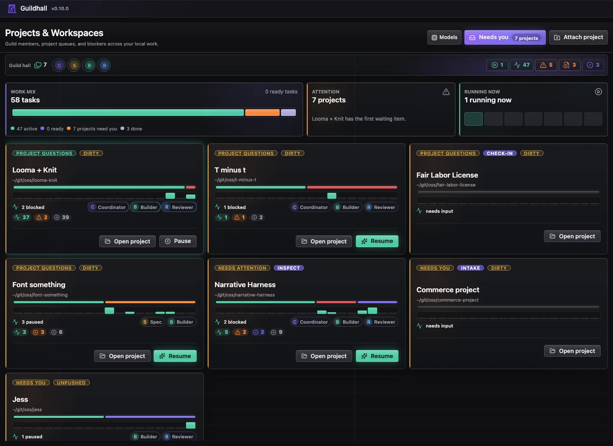
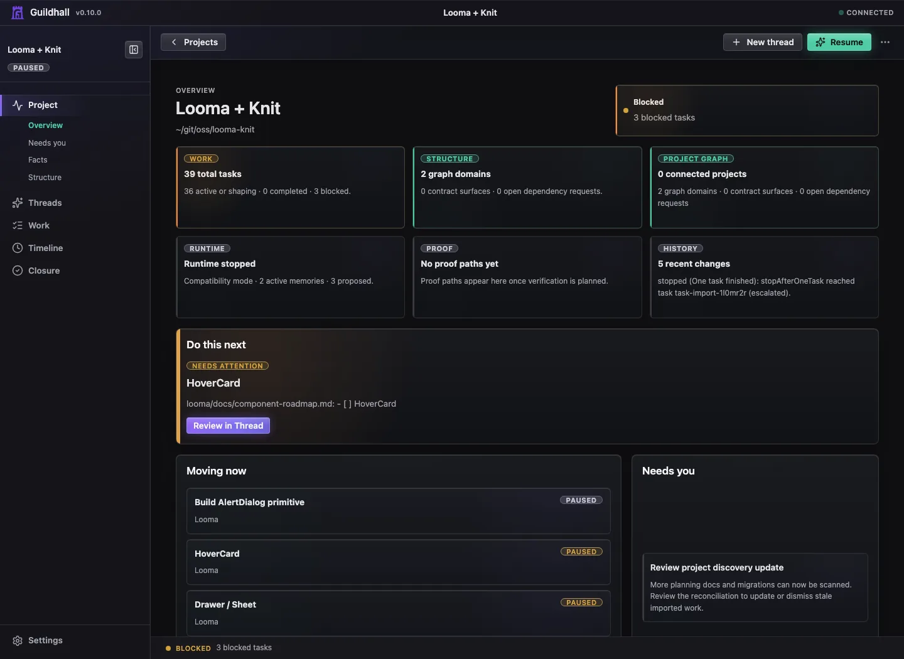
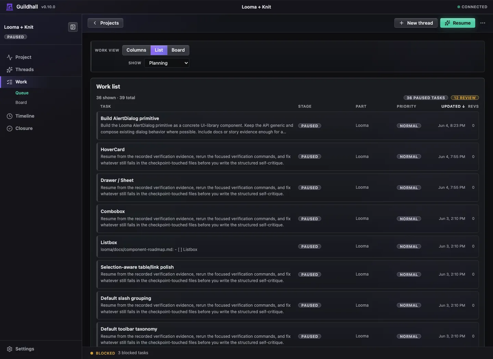

# Guildhall 0.10.0

Guildhall `0.10.0` is about making the project shell feel less scattered. When
Guildhall needs your judgment, it keeps that conversation in Threads. When you
need to understand project shape, Structure is the map room. When work crosses
project boundaries, Guildhall can show who provides the work, who checks it,
and what is still waiting.

## What changed

- **Bounded owner-input conversations:** New Request, intake, and project
  questions can open a focused conversation in Threads. The session closes with
  a receipt instead of leaving durable truth buried in a long transcript.
- **Needs you as an alert queue:** active conversations and approvals belong in
  Threads. Needs you points at the right surface instead of creating a second
  question model.
- **Cleaner project rail:** Project is the owner-facing project room, with
  Overview, Needs you, Facts, and Structure grouped together. Threads, Work,
  Timeline, and Closure remain top-level work modes. Settings stays pinned as
  configuration instead of becoming a drawer for project-intelligence surfaces.
  A section's child links stay visible while you are in that section, then hide
  when you move somewhere else.
- **Structure as the map room:** structural maps, project graph
  responsibilities, provider/consumer requests, setup review, and shared
  contract surfaces now live in Structure instead of being spread through
  Settings.
- **Local project graph handoffs:** Guildhall can represent local projects,
  domains, responsibility facets, provider requests, deliveries, consumer
  returns, and final acceptance without letting one project silently mutate
  another project's state.
- **Contract surfaces:** specs can carry the shared API, component, schema,
  design-system, or provider boundary they touch, plus the proof reviewers need
  before accepting the change.
- **State-machine receipts:** new lifecycle-heavy flows use explicit events,
  guards, and receipts so screens agree about what is waiting, accepted,
  returned, blocked, or closed.
- **Current-work closure:** Closure stays focused on the work Guildhall is
  tracking now: reviewer verdicts, gates, Git Story blockers, local residue,
  and the checks that decide whether the current work is actually closed.

## Visual tour

The 0.10 UI pass is mostly about putting each kind of work in its natural room.
Projects & Workspaces stays shallow and helps you pick where to look next.
Inside a project, the rail separates Project orientation from Threads, Work,
Timeline, Closure, and Settings.

The project shell now has a tighter split:

- **Overview** summarizes attention, task health, blocked work, activity, and
  Git Story signals before you drill into a mode.
- **Work** is a dense queue and inspector surface for logical tasks, not a dump
  of every delivery step.
- **Threads** carries bounded conversations and owner-input receipts.
- **Facts** keeps durable project facts inspectable.
- **Structure** holds the structural map, project graph, and contract surfaces.
- **Settings** stays focused on readiness, providers, identity, profiles, and
  developer controls.

## Why it matters

The old problem was not that Guildhall lacked information. It was that the
information could land in too many places: a question card here, a settings
panel there, a task drawer action somewhere else. 0.10.0 tightens that up.

Project owns orientation: Overview, Needs you, Facts, and Structure. Threads
owns the conversation, Work owns the queue, Timeline owns activity history, and
Closure owns the current-work verdict. Settings goes back to readiness,
providers, identity, profiles, and developer controls.

That makes the next move easier to trust. You should be able to tell whether
Guildhall needs an answer, a provider delivery, a consumer verification pass, a
setup decision, or a closure cleanup without reading every tab first.

## The edges

0.10.0 is still local-first. Remote planning systems can stay authoritative in
the model, but this release does not claim remote project execution. The task
lifecycle still has older status fields in places; the new state-machine
substrate is proven on bounded chat, capability requests, structural review,
and project-graph handoffs before broader lifecycle cleanup.

OpenRouter guided provider setup moved to a later release so 0.10.0 could stay
focused on owner-input coherence and the operating map.

## Read next

- [Start here](../guide/quick-start)
- [Projects and work](../guide/dashboard)
- [Project view](../web-ui/project-view)
- [How the work loop works](../guide/how-guildhall-works)
- [How Guildhall routes work](../guide/coordinators)
- [Memory, learning, and recovery](../guide/memory-and-recovery)
