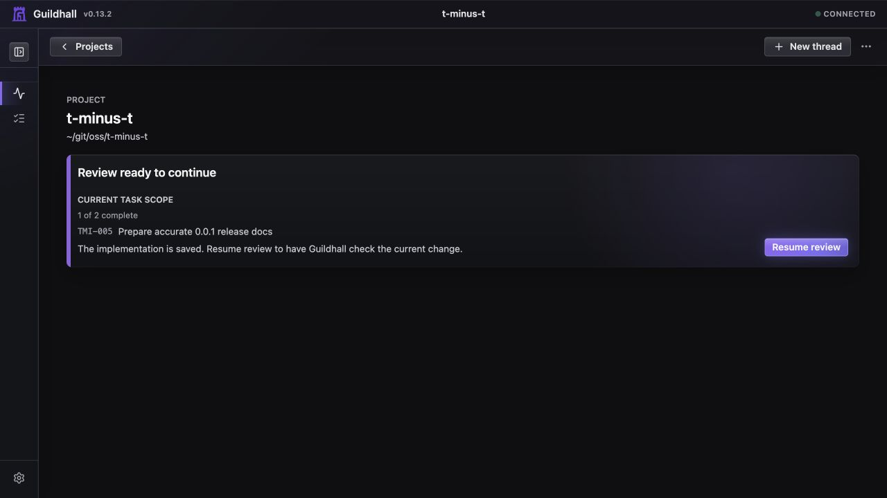
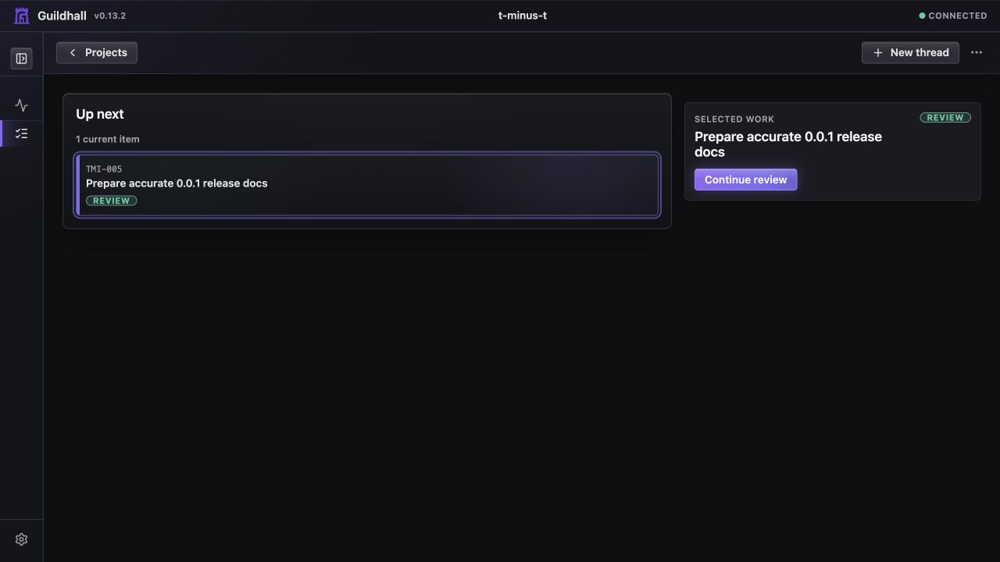

# Guildhall 0.13.2

Guildhall `0.13.2` is the reliability patch for the 0.13 release line.

## What changed

- **Stable project decisions:** a project can refresh its saved release
  decision after valid work changes without conflicting with its earlier
  decision record.
- **Truthful proof counts:** command proof and reviewer-owned proof remain
  separate requirements when a task needs both.
- **Accurate release scope:** materialized child tasks count as the work being
  delivered; Guildhall does not count their containing task twice.
- **Migration-first navigation:** when a project must be updated, its card
  takes you to the named update and its one available action instead of leading
  you toward work that cannot start yet.
- **Current route contract:** the project Map remains the single chunk for
  project structure, keeping the older Structure route as a compatibility
  redirect rather than a competing view.
- **A clear review handoff:** when implementation has landed but still needs
  verification, Overview says that plainly and offers **Resume review**. It
  does not tell the owner to rerun completed work or bury the next move in a
  drawer.

## What the owner sees

The release candidate was checked in a real local project with a completed
change waiting for review. The first screen names the current task, gives the
reason attention is needed, and exposes the one action that moves it forward.

Work preserves that same handoff when the owner wants more context. The task
remains focused; a refresh cannot silently select a different task underneath
the owner.

## Checked before release

The release candidate passes the release verification suite, type checks, and
the rendered browser flow suite. It was also installed locally and checked
against a real migration-blocked project, where the overview and Work routes
showed the required update without a blank page or console error.

## Release workflow

[Ship a release](../guide/ship-a-release) explains how to choose the current
scope, handle an approval or required update, clear checks, and finish a
release without accidentally reopening it later.
