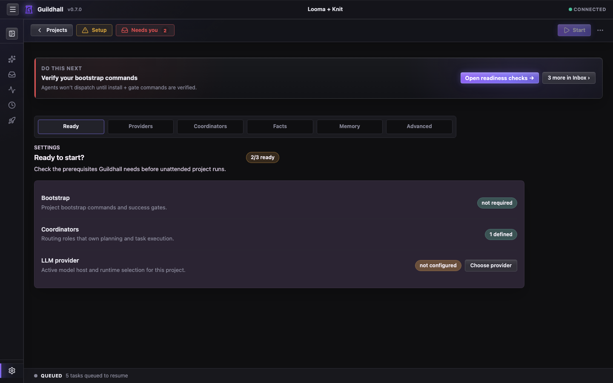

# The project shell keeps the real state in one place

Once you open a project, Guildhall shifts from "service over projects" into
"show me the state." Setup, active work, reviewer feedback, and your next
decision live in one place.

## The views that matter most

- **Thread**: the command surface. Setup prompts, spec approvals, live worker trouble, and “you need to answer this now” all gather here.
- **Work**: the queue and movement surface. This is where you judge whether the guild is making progress or just manufacturing elegant confusion.
- **Release**: the verdict lane. If something is about to ship, this surface
  tells you why it deserves the privilege.
- **Settings**: the setup and behavior layer. Ready checks, Providers,
  Coordinators, Facts, Memory, Advanced settings, and the knobs that determine
  how much autonomy the guild gets.

## What the shell is optimizing for

- Make the next real action obvious
- Keep your questions and the run's progress in the same narrative lane
- Surface release and reviewer state before it becomes an unpleasant surprise
- Let you drill into transcripts and provenance without leaving the shell

## Current strengths

- Left-rail shell structure
- Task drawer inspection model
- Release and reviewer visibility

> Still tightening: some denser views need stronger grouping, better type rhythm, and calmer summary bands. The shell already tells the truth; now it needs to tell it with more grace.
