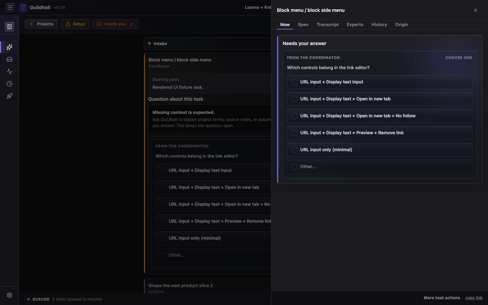
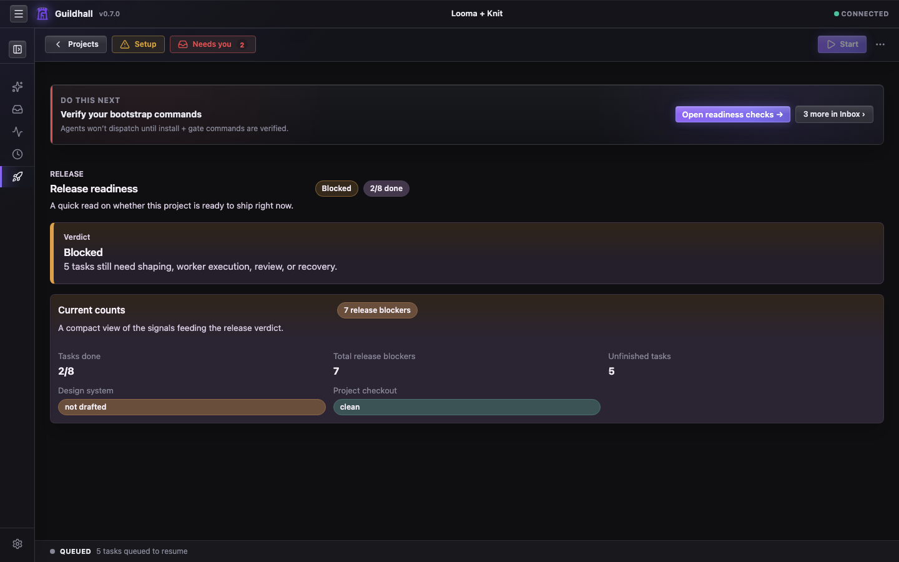

# The project shell keeps the work in one place

Once you open a project, Guildhall shifts from "service over projects" into
"show me what is happening." Setup, active work, reviewer feedback, and your next
decision live in one place.

## The views that matter most

- **Overview**: the first stop. It pulls together the next action, work mix,
  attention items, health, blocked work, recent activity, and Git Story signals
  without making you inspect every view first.
- **Thread**: the request and decision view. Setup prompts, New Request
  routing, pressure-test questions, spec approvals, live worker trouble, and
  “you need to answer this now” all gather here.
- **Work**: the queue and movement view. This is where you judge whether the guild is making progress or just manufacturing elegant confusion.
- **Release**: the verdict view. If something is about to ship, this page
  tells you why it deserves the privilege, including unresolved Git stories.
- **Settings**: the setup and behavior layer. Ready checks, Providers,
  Coordinators, Facts, Memory, Advanced settings, and the knobs that determine
  how much autonomy the guild gets.

## What the shell is optimizing for

- Make the next real action obvious
- Let you understand the project from Overview before you dive into Thread or Work
- Keep your questions and the run's progress in the same story
- Surface release and reviewer state before it becomes an unpleasant surprise
- Keep Git closure visible when work is dirty, local-only, deferred, pushed,
  waiting on a PR, or blocked by a conflict
- Let you drill into transcripts and provenance without leaving the shell

## Current strengths

- Overview as a live project summary
- Left-rail shell structure
- Task drawer inspection model
- Release, reviewer, and Git Story visibility

## Thread as the intake view

Thread is where New Request routing and Pressure-Test Intake show up. A broad
release or feature ask becomes a **New request** card, then a sequence of
**Pressure-test question** cards. Each question is answered in place, one at a
time, with evidence and the reason Guildhall is asking.

Those answers are not trapped in the transcript. They update persisted intake
state so the eventual spec can name assumptions, decisions, deferrals, and the
domains that were actually covered.

## Release as the closure view

Release readiness now treats Git state as part of the verdict. Dirty files,
local commits, branches without upstreams, pending PRs, skipped merges, stale
task worktrees, and unknown inspection failures are blockers until you close
them or deliberately mark them local-only or deferred.
