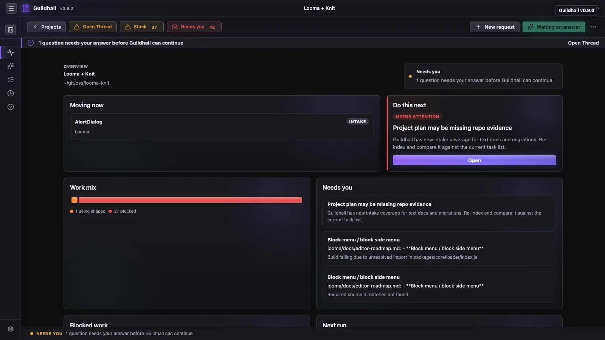
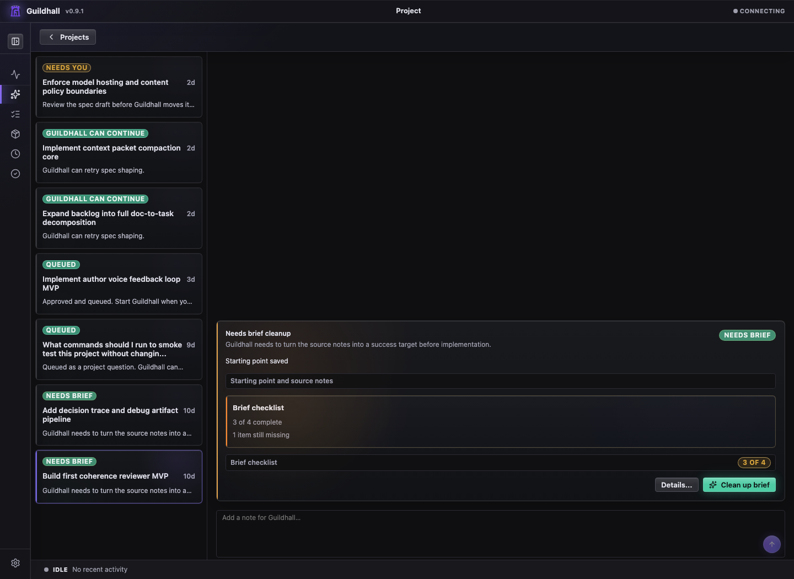
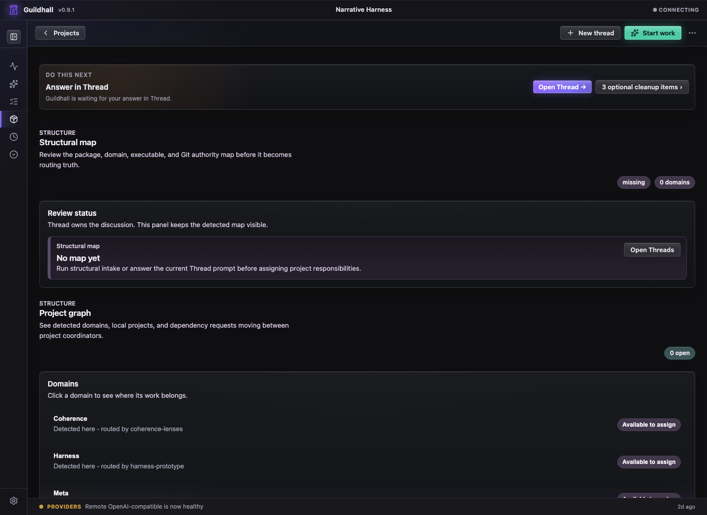
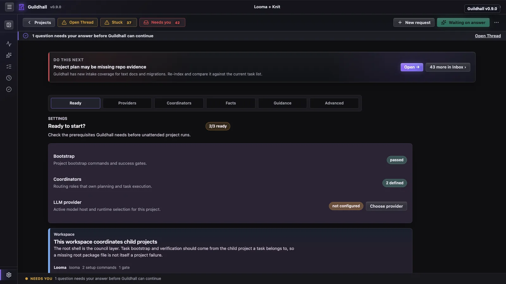
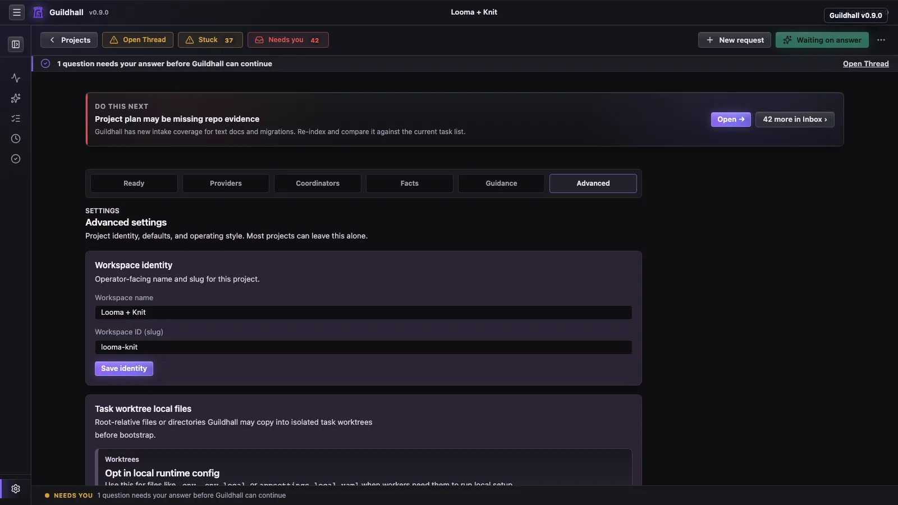

# The project shell keeps the work in one place

Once you open a project, Guildhall shifts from "service over projects" into
"show me what is happening." Setup, active work, reviewer feedback, and your next
decision live in one place.

## The views that matter most

- **Overview**: the first stop. It pulls together the next action, work mix,
  attention items, health, blocked work, recent activity, and Git Story signals
  without making you inspect every view first.
- **Thread**: the request and decision view. Setup prompts, New Request
  routing, bounded follow-up conversations, spec approvals, live worker
  trouble, and “you need to answer this now” all gather here.
- **Work**: the queue and movement view. This is where you check whether the
  project is actually moving.
- **Structure**: the map room. Structural maps, project graph responsibilities,
  provider/consumer requests, and shared contract surfaces live here instead
  of hiding in Settings.
- **Closure**: the current-work verdict view. It tells you whether the work
  Guildhall is tracking now is actually closed, including unresolved Git
  stories. It is not a version or milestone picker yet.
- **Settings**: setup and behavior. Ready checks, Providers, Coordinators,
  Facts, Memory, Re-intake, Advanced settings, and the controls that decide how
  much autonomy Guildhall gets.

## What the shell is optimizing for

- Make the next real action obvious
- Let you understand the project from Overview before you dive into Thread or Work
- Keep your questions and the run's progress in the same story
- Surface closure and reviewer state before it becomes an unpleasant surprise
- Keep Git closure visible when work is dirty, local-only, deferred, pushed,
  waiting on a PR, or blocked by a conflict
- Let you drill into transcripts and provenance without leaving the shell

## Current strengths

- Overview as a live project summary
- Left-rail shell structure
- Task drawer inspection model
- Closure, reviewer, and Git Story visibility
- Sparse project controls with one primary Start or Stop path
- Re-intake when old project state needs to be reconsidered

## Start, stop, and blockers

The top bar is for the main action, not every possible status. **Start** or
**Stop** should remain easy to find. If the project cannot move yet, the control
is disabled and the notice below it names the blocker with a route to the exact
question, spec, migration, or task that needs attention.

Generic labels are not enough. A card that says the project needs you should
also tell you what it needs and where to answer.

## Thread as the intake view

Thread is where New Request routing, bounded owner-input sessions, and
Pressure-Test Intake show up. A broad release or feature ask can become a
focused conversation; a task-like ask waits to create work until the missing
briefing question is answered; and a pure project question can resolve as a
conversation receipt without pretending it was implementation work.

Each question is answered in place, one at a time, with evidence and the reason
Guildhall is asking. Other views can point you back to the same conversation,
but they should not invent their own parallel question cards.

Those answers are not trapped in the transcript. They update persisted intake
state so the eventual spec can name assumptions, decisions, deferrals, and the
domains that were actually covered.

## Structure as the map room

Structure keeps durable project shape visible without turning Settings into a
junk drawer. The structural map shows packages, domains, executable units, Git
authority, and review questions. The project graph shows which local project
or domain owns a responsibility, which provider/consumer requests are moving,
and which side still needs to verify delivery.

Contract surfaces live here too. A contract surface is the shared shape a task
must fit: component APIs, route or event schemas, design-system token and
variant rules, provider boundaries, or other durable conventions. When a spec
touches one of those surfaces, Guildhall can attach a surface review packet so
workers and reviewers see the sibling specs, invariants, decisions, and proof
obligations before changing the shape.

## Re-intake stale project state

Use **Settings -> Re-intake** when a project has old imported tasks, stale
blockers, or cards that no longer match what the repo and docs say. Re-intake
reads current evidence, compares it with accepted tasks and progress, and drafts
a cleaner plan for review. Empty drafts cannot be applied, and applying a
re-intake records why the project plan changed.

## Closure as the current-work view

Closure treats Git state as part of the verdict. Dirty files, local commits,
branches without upstreams, pending PRs, skipped merges, stale task worktrees,
and unknown inspection failures are blockers until you close them or
deliberately mark them local-only or deferred.

For now, Closure means "the current Guildhall-tracked work," not "the next
named software release." Future release or milestone grouping can sit on top of
the same checks once Guildhall has an actual release target to point at.
