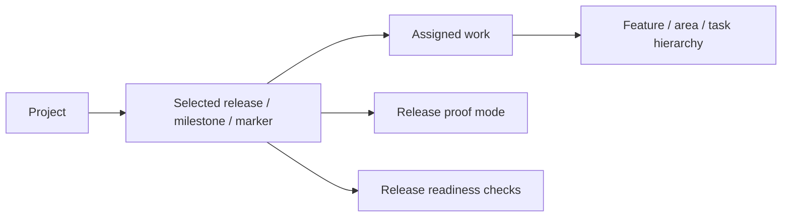

# Unified Releases Model

## Problem

Guildhall has been using several words for the same user job:

- `Current scope` in the project orientation spine;
- `Closure` in the top-level project navigation;
- `release-readiness` as an API name;
- hard-coded MVP-ish labels in the Project Map;
- task hierarchy as an implied release boundary.

That failed because none of those concepts is the durable planning container the
user actually needs. A project can keep evolving forever. A release, milestone,
or owner-named marker is the thing that can become ready, ship, close, or move
aside. Tasks and feature trees are work structure inside that container; they
are not the container.

## Product Model

Guildhall's planning model becomes:

Important: the owner-facing release node is optional. A project can have no
defined release. In that case Guildhall uses a hidden internal `Current work`
container so future release assignment does not require task/model rewrites,
but it must not present that hidden container as a fake MVP, version, milestone,
or release.

### Release

A release is an owner-meaningful planning container. It may be called `MVP`,
`2.0 alpha`, `Launch hardening`, or `Migration phase 3`. Guildhall must not
assume every project has an MVP, and it must not assume every project has a
release at all.

Release fields:

- `id`
- `label`
- `kind`: `release`, `milestone`, `marker`, or `current_work`
- `state`: `planned`, `active`, `ready`, `shipped`, or `deferred`
- `source`: `owner_approved`, `spec`, `release_plan`, or `inferred`
- `description`
- `nodeIds`: assigned work node ids
- `deferredNodeIds`: known work outside this release
- `proofStyle`: `script_only`, `manual`, `mixed`, or `unspecified`
- `branchPolicy`: optional release branch policy, such as `none`,
  `release_branch`, or `per_task_branch`

### Scope

`scope` is no longer the owner-facing release concept. It remains a
compatibility alias for the current work set. When a release is selected, scope
is the work assigned to that release. When no release exists, scope is the
hidden internal `Current work` container.

### Task Hierarchy

Task hierarchy answers: "How is this work decomposed?"

Release assignment answers: "Which release is this work in?"

Those can overlap but are not the same. A feature can contain tasks and steps;
any visible unit can be assigned to a release. Hidden internal steps inherit the
release of the nearest visible ancestor unless explicitly assigned elsewhere.

### Start Boundary

When releases are defined, pressing `Start` on a project runs only work assigned
to the selected release. It may run child work and prerequisites needed by that
release, but it must not consume later-release work during a normal unattended
project run.

When no releases are defined, `Start` keeps today's behavior: it consumes the
normal runnable current-work queue through the hidden `Current work` container.
No release selection is required.

If more than one active/planned release exists and none is selected, Guildhall
should choose an already persisted `selectedReleaseId`; otherwise it should ask
the owner to select the release before starting. If exactly one active/planned
release exists, it can be selected automatically.

Release branches are a separate policy, not the release model itself. Guildhall
may support a release branch when the repo or owner wants switchable release
workstreams, but a release does not require its own branch to act as the
execution boundary.

### Readiness

Readiness asks whether the selected release is ready. It is not a generic
"closure" page. Git story state, dirty Guildhall files, unfinished work, design
system approval, brief/spec approvals, and proof gaps are checks under release
readiness.

## Intake and Inference

Guildhall collects release information from the least-burdensome source first:

1. Persisted release records in `TASKS.json`.
2. Owner-approved release or milestone labels captured by intake/spec work.
3. No owner-facing release. Guildhall uses the hidden `Current work` container,
   shows `Current work`, and keeps release-specific controls hidden or neutral.

The orientation charter's `currentReleaseTarget` may explain current-work
boundaries or proof style, but it must not manufacture a visible release label.
An explicit scope passed to the orientation builder is a compatibility/current
work boundary unless it is backed by a persisted release record.

Guildhall asks the owner only when multiple plausible active releases would
change what work is selected or when moving work between releases changes
product intent. It should not ask the owner to approve mechanical splitting,
proof-mode detection, or hierarchy cleanup.

## UI Contract

Project Map is the 1,000-foot view:

- project goal and audience;
- selected release summary;
- all assigned feature/work lanes;
- deferred work count;
- source trail for charter, release, work records, and proof mode.

Overview is the 100-foot view:

- what changed recently;
- what Guildhall is doing now;
- lean release summary;
- next useful action.

Release is the readiness view:

- selected release label;
- readiness verdict;
- blockers grouped by check type;
- links to the work that resolves each blocker.

No primary product UI should show `Closure` as a navigation concept. The word
`closure` can remain only in internal code where it describes a completed
bounded-chat session or a git-story state machine.

## Contract Touch Decision

- **Work id:** unified-releases-2026-06-17
- **Touched contracts:** `TaskQueue`, orientation spine payload,
  `/api/project/release-readiness`, project Start task selection, project view
  navigation labels.
- **Contracts considered but not touched:** bounded-chat `closure` receipts and
  git-story closure state, because those are lower-level completion concepts and
  not product navigation.
- **Required follow-up:** remove the compatibility `scope` alias after all UI
  and API consumers read `selectedRelease`.
- **Proof required:** runtime tests for inferred releases and explicit non-MVP
  releases; Start/picker tests proving unattended project runs only consume the
  selected release; API tests proving release-readiness returns the selected
  release; Svelte tests proving Map/Release render `Release` concepts and no
  top-level `Closure` nav remains; installed-app browser proof on a real
  project.
- **Apply/revert behavior:** this is a forward schema-compatible addition.
  Existing queues without `releases` parse with an empty release list and use a
  hidden `Current work` container.

## Schema Migration Decision

- **Persisted schema touched:** `TaskQueue`, `Task`.
- **Scope:** project-local task state.
- **Change class:** backward-compatible optional fields.
- **Existing data impact:** old queues load unchanged; runtime shows current
  work when no persisted owner-facing release exists.
- **Migration id:** `2026-06-17/unified-releases`.
- **Safety:** no destructive migration required.
- **Required before run:** no.
- **Compatibility reader:** `TaskQueue` defaults `releases` to `[]`; tasks
  default `releaseIds` to `[]`; empty release lists mean the hidden current-work
  container is selected, not an owner-facing release.
- **Fixtures/tests:** core schema tests, orientation spine tests, release
  readiness endpoint tests, Map/Release Svelte tests.
- **Owner-facing plan text:** old "Current scope" becomes "Current work" when
  no release exists, and the selected release label when a release exists.
  "Closure" becomes release/work readiness.
- **Rollback/revert behavior:** remove optional fields and fallback to inferred
  release if persisted release state is invalid.

## Work Tracker

- [x] Audit existing hard-coded `Closure`, `Current scope`, and MVP-ish release
  labels.
- [x] Write the unified Releases model spec.
- [x] Add persisted release records to `TaskQueue` and release assignment ids to
  tasks.
- [x] Add selected-release derivation to the orientation spine.
- [x] Make normal unattended project Start consume only selected-release work
  when release records exist.
- [x] Make `/api/project/release-readiness` return the selected release instead
  of hard-coded `Current Guildhall work`.
- [x] Update Project Map to render `Current work` when no release exists, and
  the selected release plus source trail when a release does exist.
- [x] Update Release readiness to render the same selected release and remove
  owner-facing `Closure` language.
- [x] Update navigation and tests so top-level project UI uses `Release`.
- [x] Verify the model with a no-release project and an explicit non-MVP release
  such as `2.0 alpha`.
- [x] Run contract lint, focused tests, typecheck, build, install, restart, and
  browser proof.

### Verification Evidence

- Focused runtime/UI tests:
  `pnpm vitest run src/runtime/__tests__/project-orientation-spine.test.ts src/runtime/__tests__/orchestrator-picker.test.ts src/runtime/__tests__/serve-release-readiness.test.ts src/web/surfaces/__tests__/ProjectView.svelte.test.ts src/web/surfaces/project/__tests__/ReleaseTab.svelte.test.ts src/web/surfaces/project/__tests__/ProjectMapTab.svelte.test.ts --reporter=dot`
  passed `100` tests.
- Static checks: `pnpm typecheck`; `pnpm lint:contracts`.
- Build/install proof: `pnpm build`; `pnpm dev:install`; `guildhall stop &&
  guildhall start`; `/api/stale-server` reported `stale:false`.
- Real-project API proof: Narrative Harness
  `/api/project/release-readiness?projectId=narrative-harness` returned
  `release:null` and `scope.label:"Current work"`.
- Real-project browser proof: Narrative Harness Release page at desktop
  `1280x720` showed `Current work readiness`, `Current counts`, and `Total
  blockers`, with no `MVP boundary`, `Current release`, `Selected release`,
  `Closure`, `release verdict`, or `Total release blockers` copy. Project Map
  showed `Project map`, `Current work`, and `Source trail`, with no fake release
  label.
- Mobile browser proof at `390x844`: Release and Map had no horizontal overflow
  (`scrollWidth === clientWidth === 390`) and preserved the same key copy.
