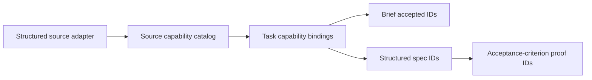

# Source Capability Authority

**Status:** implementation plan

## Problem

Guildhall currently lets Markdown, source claims, generated briefs, and task
descriptions carry overlapping ideas of what work exists. A task can therefore
look source-backed while a later brief/spec silently narrows its actual scope.
Trying to catch that by comparing words would overfit to model prose and still
leave multiple authorities.

## Decision

Use one normalized source-capability catalog and one task-binding relation.



The catalog owns capability identity, lifecycle, source revision, release
membership, dependencies, and evidence references. A task owns only its typed
relationship to a catalog capability:

- `plans`
- `implements`
- `integrates`
- `proves`
- `reviews`

The brief and spec must name exactly the task's bound IDs. Every bound ID that
the task plans must link to at least one structured acceptance criterion. The
system checks IDs and graph relations only; labels, snippets, agent prose, and
agent identity are display/audit material.

## Source Intake

Only a structured source adapter or a delegated owner can create catalog
capabilities. Each adapter snapshot supplies stable adapter-owned IDs and a
revision. Markdown, Git history, TODOs, transcripts, and map documents may
remain evidence sources, but they cannot create executable work, release
membership, or coverage claims.

When a source is prose-only, Guildhall presents it as evidence and asks the
delegated owner to shape explicit capabilities once. It does not scrape bullets
into task authority.

## Storage And Writes

SQLite owns both relations:

```text
source_capabilities(
  capability_id, adapter_id, adapter_schema_version, source_revision,
  state, release_ids_json, depends_on_ids_json, evidence_refs_json
)

task_capability_bindings(task_id, capability_id, relation)
```

Both are written through the same CAS transaction as task definitions, scope
rows, release membership, and the compact project projection. Task JSON may
carry a hydrated read projection for compatibility only; it is never the
authoritative binding store. A point task mutation must strip binding fields
from the detail payload and rehydrate them from SQLite on read.

The compact summary carries only a revision-aligned catalog digest:
availability (`unavailable`, `empty`, or `ready`) and planned/retired/total
counts. It deliberately does not embed labels, source text, or capability
lists. Map, Overview, Work, Release, Thread, and fleet surfaces receive that
one digest with the same project revision as their action and scope state;
they must not each fetch the catalog or reinterpret source documents.

## Split And Delegation

No recommendation is persisted merely to say work should split. A coordinator
materializes child work when scope requires it, then atomically allocates the
parent's capability bindings to children. Parents retain `plans`; children get
the appropriate implementation/proof/review relation. The write rejects an
unallocated required parent capability. This works at any hierarchy depth and
does not require a fixed feature/task/step taxonomy.

## Migration

1. Add catalog and binding tables, indexes, read APIs, and transaction inputs.
2. Add typed task/brief/spec/criterion fields and coverage validation against
   bindings, not source claims.
3. Add structured adapter snapshots and delegated-owner catalog intake.
4. Stop evidence-work-graph and reintake from materializing executable work
   from Markdown/table/roadmap parsing.
5. Mark old tasks `unbound_legacy`; retain evidence but do not synthesize IDs
   or bindings from prose.
6. Re-intake Narrative Harness through the new boundary, then prove its
   selected release across Map, Overview, Work, Release, Thread, and restart.

## Proof

- Reordering adapters, agents, or evidence prose leaves catalog/binding scope
  unchanged.
- A brief/spec that omits a bound capability is rejected.
- A split cannot leave parent capability scope unallocated.
- Legacy text cannot produce catalog rows or executable work.
- Catalog, bindings, task details, release summary, and Map are identical at
  the same project revision after restart.
- A catalog-only write changes the shared summary digest atomically, while
  leaving task rows and release membership untouched.
