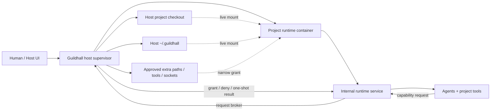

# Podman project runtime

**Status:** 0.9.0 runtime foundation

**Release scope:** Guildhall 0.9.0 should make project execution containerized
by default when the Guildhall host app/CLI is running on a supported macOS
installation that can run Podman. Existing host-run projects should migrate
into project runtimes with an explicit compatibility path.

**Guildhall host platform support:** Guildhall 0.9.0 is release-supported when
the Guildhall host app/CLI is running on macOS. This says nothing about the
project's own stack or deployment target. A web app, library, CLI, or service
project can still be worked on; the support boundary is the machine running
Guildhall. Linux and Windows are not 0.9.0 supported Guildhall host
environments unless a later release plan explicitly adds them. Implementation
should avoid needless macOS-only coupling where abstraction is cheap, but
owner-facing compatibility, guided setup, docs, screenshots, and release testing
should speak plainly: 0.9.0 supports Guildhall hosts on macOS.

This is not an optional isolation experiment. It is the execution foundation for
trustworthy autonomous project work.

The goal is not "containers because containers." The goal is to give every
Guildhall project a boring, inspectable, disposable Linux workspace where agents
can install tools, run commands, start dev servers, and make mistakes without
turning the user's host machine into the blast radius.

## 0.9.0 Product Goal

When a user registers or opens a project in Guildhall 0.9.0, Guildhall should
prefer running that project through a managed project runtime:

1. The host app remains the trust, approval, UI, and evidence surface.
2. The project runtime is normally stopped until Guildhall needs to run work.
3. Starting an AI task, command, proof path, dev server, or browser check starts
   the runtime on demand.
4. The project runtime runs ordinary project commands inside a container.
5. The project source and host-owned Guildhall state are mounted deliberately.
6. Every project runtime mounts both the selected project checkout and host
   `~/.guildhall`.
7. Anything outside those mounts becomes an explicit capability request.
8. The runtime can be stopped, rebuilt, inspected, and migrated without losing
   Guildhall memory or user-authored project files.

The user should not need to learn containers to benefit from this. The visible
product promise is:

> Guildhall works inside a bounded project workspace by default. If it needs
> more reach, it asks.

## Core Invariants

- The runtime is disposable. Guildhall memory is not.
- Durable Guildhall state, evidence, task history, artifacts, and logs live in
  host-owned `~/.guildhall` from day one.
- Every project runtime mounts host `~/.guildhall` at the stable in-container
  Guildhall home path. Runtime-local state is not the source of truth.
- Project source stays host-owned and live-mounted, so the user's editor,
  backups, Git tools, and normal inspection workflow keep working.
- Agents run normal project commands inside the project runtime by default.
- A runtime can only see the selected project, mounted Guildhall state, and
  approved extra capabilities.
- Extra directory access is a human-intervention moment, not an ambient agent
  privilege.
- The host UI remains the place where permissions, logs, questions, artifacts,
  proof, and recovery are visible.
- Runtime isolation is containment, not a promise that untrusted code is safe.
  The UI must not imply stronger security than the actual local container
  boundary provides.

## Runtime Topology



The host supervisor is the trust boundary. The project runtime is the work
boundary. Most work should stay inside the runtime; anything that touches the
user's wider machine crosses the host supervisor deliberately.

## Default Runtime Shape

The default should be one managed runtime container per active project, stopped
by default and started on demand.

Per-project runtimes give Guildhall the simplest owner-facing contract:

- dependencies, dev servers, ports, processes, and failures do not blend across
  unrelated projects;
- project-specific capability grants are easy to explain and revoke;
- logs and command evidence can be tagged to one project runtime;
- rebuilding one runtime does not disturb another project;
- a project can carry a runtime manifest without affecting other projects.

This does not mean one Debian VM per project. On macOS, Podman runs containers
inside a Podman machine; multiple project containers share that VM, the Linux
kernel inside it, and immutable image layers. On Linux, containers share the
host kernel directly. The per-project boundary is mostly process namespace,
mount namespace, writable container layer, ports, grants, and logs.

The important distinction is:

- **shared substrate:** Podman machine, base image layers, downloaded base
  images, and optional read-through caches;
- **project-specific runtime:** mounts, writable container layer, processes,
  ports, capability grants, command logs, and cache volume.

Guildhall should use the shared substrate aggressively while keeping project
authority project-scoped.

## Project Isolation Without Unnecessary Overhead

The clever version is not "one giant shared container." That saves a little
setup cost but loses the clean boundary between projects.

The clever version is:

1. **Shared base image layers.** Keep common tools in versioned Guildhall base
   images: Debian, Node, Python, Git, ripgrep, Playwright dependencies, common
   build tools. Project containers share those layers automatically.
2. **Per-project writable runtime.** Each project gets its own container
   filesystem and its own process namespace.
3. **Per-project cache volumes by default.** Package-manager caches, browser
   downloads, build caches, and language caches can live in named volumes scoped
   to the project. They survive container rebuilds but do not cross-contaminate
   unrelated projects.
4. **Optional shared read-through caches later.** If install performance becomes
   painful, add a host-owned cache proxy or read-through artifact cache. Avoid a
   writable shared cache volume that lets one project poison another.
5. **Shared image, isolated mounts.** The project mount and `~/.guildhall` mount
   are explicit. Extra host paths are never inherited from another project.
6. **Off by default.** A registered project does not need a running container
   just because it exists or appears in the UI.
7. **Start on demand.** Start the runtime when Guildhall begins AI work, runs a
   command, opens a proof path that needs a live service, starts a dev server,
   or performs runtime-backed browser verification.
8. **Idle suspension.** Stop project containers when there is no active work,
   live dev server, pending command, or owner-approved keep-alive reason. Keep
   the project cache volume and host state so restart is cheap.

This gives real project isolation at the places that matter: mounts, processes,
ports, capability grants, logs, and writable runtime state. The shared parts are
base image layers and deliberately scoped caches, which are performance
infrastructure rather than project authority.

Running twelve projects in parallel would mean twelve project containers only if
all twelve projects are actively doing work at the same time. That is not twelve
copies of Debian Linux in the VM sense, but it is twelve sets of project
processes, writable layers, port mappings, and possibly dev servers. The real
cost is the active work each project is doing, not the existence of twelve
containers that share an image.

If per-project runtimes turn out to create unacceptable overhead on real
projects, Guildhall should degrade explicitly:

- keep command execution containerized but allow a "shared development runtime"
  policy only with clear UI labeling;
- keep capability grants project-scoped even if the underlying container is
  shared;
- show the isolation downgrade in Settings and task evidence;
- never silently collapse unrelated projects into the same ambient workspace.

## Host And Runtime Split

The host supervisor owns:

- project registration and migration;
- runtime lifecycle: create, start, stop, rebuild, inspect, remove;
- image updates and compatibility checks;
- port allocation and host URL routing;
- durable Guildhall state in `~/.guildhall`;
- permission controls for mounts, ports, credentials, host tools, and local
  daemons;
- presentation of logs, questions, artifacts, evidence, and capability
  requests;
- migration fallback when a project cannot run inside the default runtime.

The project runtime owns:

- command execution;
- tool installation;
- repo-local package installs;
- dev server processes;
- test/browser/runtime checks;
- disposable filesystem state;
- project-scoped cache volumes;
- runtime-local logs before they are persisted through Guildhall evidence APIs.

The runtime should write nothing important only to its own ephemeral filesystem.
If deleting and recreating the runtime would lose meaningful Guildhall state,
evidence, project metadata, or user-authored work, the boundary is wrong.

## Runtime Lifecycle

Project runtimes should be dormant until useful.

Normal lifecycle:

1. Project is registered. No container is running yet.
2. Owner or scheduler starts AI work, runs a command, opens a runtime-backed
   proof path, or requests a dev-server/browser proof.
3. Host supervisor starts the project runtime.
4. Host supervisor verifies the project mount, `~/.guildhall` mount, runtime
   user, and required capability grants.
5. Work runs inside the runtime.
6. Runtime stays alive while commands, dev servers, browser checks, or approved
   keep-alive reasons are active.
7. Runtime stops after an idle timeout when no active work remains.

Stopping a runtime must not stop the project from existing in Guildhall. It
should only stop the live execution environment. Project memory, tasks,
evidence, settings, and logs remain in host `~/.guildhall`; project source
remains in the host checkout; project cache volumes remain available for the
next start.

If a project needs a dev server to remain live for manual proof, that should be
an explicit keep-alive state with visible stop controls, not an accidental
always-on container.

## Installation And Migration Contract

### New Installations

For new 0.9.0 Guildhall installations on macOS, project runtimes should be the
normal path:

1. Detect whether the host platform is macOS. If not, show host-run
   compatibility mode and explain that runtime-backed mode is not supported for
   this 0.9.0 release.
2. Detect whether Podman or the supported runtime backend is available.
3. If the backend is missing or stopped, offer guided setup instead of silently
   installing anything or leaving the owner to guess what to do.
4. Guided setup is still Guildhall-operated setup: after explicit owner
   approval, Guildhall runs the supported setup action itself and reports
   progress/results in the UI. The owner should not have to copy a `podman
   machine` command just to finish the normal path.
5. Supported setup actions include installing Podman through a macOS route the
   owner actually has available. Homebrew is allowed when present, but it must
   not be assumed. If Homebrew is missing, Guildhall should point to the
   official Podman macOS installer path and continue guiding setup after the
   install completes.
6. Once the Podman CLI exists, supported setup actions include initializing the
   Podman machine with `podman machine init --now` (or an equivalent init/start
   sequence when needed), and starting a stopped Podman machine.
7. Let the owner choose host-run compatibility mode instead, and label that mode
   as less isolated.
8. Create or update the Guildhall base image.
9. Register the project.
10. Create a project runtime manifest.
11. Mount the project and host `~/.guildhall`.
10. Run runtime health checks.
11. Run project orientation checks inside the runtime.
12. Show the project as runtime-backed.

### Existing Projects

Existing host-run projects should get a guided migration:

1. Inspect the project and current Guildhall state.
2. Create a runtime manifest from current defaults and detected stack.
3. Boot the project runtime without changing task state.
4. Run mount, ownership, command, and dev-server checks.
5. Compare key commands against host expectations where possible.
6. Mark the project as runtime-backed only after checks pass.
7. Keep a host-run fallback until the owner accepts the migration.

Migration should be reversible at the project level. Reverting should not delete
project source or Guildhall memory.

### Unsupported Environments

If the local environment is not macOS, or cannot run the supported runtime,
Guildhall should say that plainly, offer guided setup when possible, and
continue with a host-run mode that is visibly less isolated if the owner
declines or setup fails.

Host-run mode should not pretend to have the same containment guarantees. It
should be labeled as a compatibility mode, with clear upgrade guidance.

## Default Image Bias

Start with Debian 13 (`trixie`) slim as the default 0.9 base image.

That gives agents the least-surprising Linux target:

- glibc instead of musl;
- common package names and install docs;
- predictable shell/coreutils behavior;
- broad compatibility with Node, Python, Playwright, Git, and native build
  dependencies;
- fewer Alpine-specific edge cases for LLMs to reason around.

Use explicit image tags and, for released Guildhall images, pinned digests. Do
not use floating `latest` as the project runtime base. The first default image
family should look like:

```text
guildhall/runtime-debian:0.9-trixie
guildhall/runtime-debian:0.9-trixie-node22-python313-playwright
```

The base image should include the boring baseline tools Guildhall expects in
nearly every project runtime:

- Debian 13 (`trixie`) slim;
- `bash`, `coreutils`, `ca-certificates`, `curl`, `git`, `openssh-client`;
- `ripgrep`, `findutils`, `jq`, `tar`, `unzip`, `xz-utils`;
- Node.js 22 LTS with Corepack enabled for JavaScript projects;
- Python 3.13 with `pipx` and virtualenv support for Python projects;
- Playwright system dependencies, with browser binaries placed in a
  project-cache-friendly path;
- common native build tools needed by npm, Python, Rust, and similar packages;
- a non-root `guildhall` user with predictable uid/gid mapping.

Version contract:

| Layer | 0.9 default | Notes |
|---|---|---|
| OS | Debian 13 `trixie-slim` | Current Debian stable as of 2026; pin released images by digest. |
| Node | Node.js 22 LTS | Default JavaScript lane. Let projects request Node 20 or newer LTS lines through the runtime manifest. |
| Package managers | Corepack-managed pnpm/yarn plus npm | Respect project `packageManager` when present. Avoid global mutable package-manager drift. |
| Python | Python 3.13 | Use virtualenv/pipx; projects can request older Python if their stack needs it. |
| Browser | Playwright-compatible Chromium baseline | Put browser downloads in project cache volume or a controlled shared read-through cache. |
| Shell/tools | Bash, Git, rg, jq, build-essential class tools | The agent should get predictable Linux docs and commands. |

The default image should be good enough for common TypeScript, Svelte, Nuxt,
Vite, Python, docs, and browser-test projects. It should not try to predict
every stack. Projects that need Rust, Go, Java, .NET, system packages, or a
specific Node/Python line should extend or select a runtime image through the
manifest.

Keep Debian 12 (`bookworm`) as an explicit compatibility image only if real
projects hit `trixie` regressions. The default should track current Debian
stable, not oldstable.

Alpine is attractive for size, but size is less important than reducing runtime
surprise. A tiny image that makes every install/debug loop stranger is the wrong
optimization for an agent workspace.

Guildhall should later support project-level runtime manifests that can select
or extend base images, but the default should optimize for boring compatibility.

## Runtime Executables

The image needs stable executables, not just packages.

Minimum Guildhall-owned executables:

- `guildhall-runtime`: starts the internal runtime service inside the
  container.
- `guildhall-exec`: runs one typed command request as the `guildhall` user and
  emits structured command events.
- `guildhall-healthcheck`: verifies mounts, user ids, tool versions, write
  access, DNS, cache paths, and optional dev-server/browser readiness.
- `guildhall-capability-request`: emits a structured capability request to the
  host supervisor when work needs access outside the runtime.
- `guildhall-runtime-info`: prints runtime id, project id, image version, tool
  versions, mount layout, cache paths, and supported operation schema.

Minimum third-party executables expected on `PATH`:

- `bash`, `sh`, `env`;
- `git`, `ssh`;
- `rg`, `find`, `jq`;
- `node`, `npm`, `corepack`;
- `python3`, `pipx`;
- `npx` and package-manager shims activated by Corepack when a project declares
  them;
- browser runner dependencies for Playwright-compatible checks.

The host supervisor should not guess whether the image is compatible. It should
run `guildhall-runtime-info` and `guildhall-healthcheck` before marking a
runtime usable.

Entrypoint convention:

```text
ENTRYPOINT ["guildhall-runtime"]
```

The internal service should accept a bounded set of environment variables:

```text
GUILDHALL_PROJECT_ID
GUILDHALL_RUNTIME_ID
GUILDHALL_PROJECT_ROOT=/workspace/<project-slug>
GUILDHALL_HOME=/home/guildhall/.guildhall
GUILDHALL_RUNTIME_TOKEN=<scoped runtime token>
GUILDHALL_HOST_CALLBACK=<loopback or broker endpoint>
```

Do not rely on the container image having the user's project dependencies
preinstalled. Project dependencies belong to the mounted project and
project-scoped cache volume unless the project manifest selects a custom image.

## Release, Publishing, And Updates

The runtime transition turns a Guildhall release into a multi-artifact release.

0.8.x can mostly publish one npm package and one macOS package. 0.9.0 needs a
coordinated release set:

- `guildhall` npm package;
- macOS packaged host app/CLI artifact;
- one or more runtime container images;
- docs snapshot and release notes;
- project/runtime migration code;
- compatibility metadata that tells the host which runtime images it can use.

The release contract should be explicit: the host supervisor owns the product
version, and runtime images are compatible execution artifacts for that host.

### Version Lines

Use aligned, semver-readable runtime image tags:

```text
guildhall/guildhall:0.9.0
guildhall/runtime-debian:0.9.0-trixie-node22-python313-playwright
guildhall/runtime-debian:0.9-trixie-node22-python313-playwright
```

Recommended meaning:

- `0.9.0-*`: immutable release image for exact host release compatibility.
- `0.9-*`: moving patch-line convenience tag for users who accept patch updates
  within the same minor line.
- digest pin: the value stored in project runtime state after an image is pulled
  or selected.

Do not use `latest` for project runtime selection. `latest` is fine for humans
looking at a registry, but Guildhall should resolve to a version tag and digest
before a runtime is marked usable.

### Host Node Versus Project Node

Keep these separate:

- **Host supervisor Node:** the Node version bundled in the npm/macOS Guildhall
  host app. Current Guildhall packaging already bundles a Node executable in the
  macOS artifact. 0.9 should choose and test the host Node line deliberately,
  probably Node 22 LTS unless compatibility argues for keeping Node 20 for one
  more minor.
- **Project runtime Node:** the Node version available to project commands
  inside the container. The 0.9 default is Node 22 LTS, but projects can request
  another LTS line through the runtime manifest.
- **Project dependency Node:** a project's own `.node-version`, `.nvmrc`,
  Volta config, package manager metadata, or runtime manifest can override the
  default if the project needs it.

The host supervisor should not assume that its bundled Node version matches the
project runtime Node version. They solve different problems.

### Container Image Publishing

The release workflow publishes runtime images to GitHub Container Registry
(`ghcr.io`). GHCR is the OCI/container registry attached to GitHub; it keeps the
runtime images near the source repo, release workflow, tags, permissions, and
GitHub release artifacts.

0.9 should publish the default runtime image as:

```text
ghcr.io/matthew-dean/guildhall-runtime-debian:0.9.0-trixie-node22-python313-playwright
ghcr.io/matthew-dean/guildhall-runtime-debian:0.9-trixie-node22-python313-playwright
```

If the repo moves under an organization before 0.9 ships, the release manifest
should carry the actual registry path. The implementation should not hardcode
the owner outside release metadata.

The image lane should:

- build the runtime image from a committed `Containerfile`;
- install the Guildhall runtime executables;
- run `guildhall-runtime-info`;
- run `guildhall-healthcheck` in a container with temporary project and
  `~/.guildhall` mounts;
- verify Node, Python, Corepack, Git, rg, jq, Playwright dependencies, and the
  non-root `guildhall` user;
- smoke-test command execution through `guildhall-exec`;
- publish immutable version tags and patch-line tags;
- record the image digest in a release manifest.

The release should not publish npm successfully and then leave the runtime image
unpublished or unverified. If the runtime image is part of the supported
install story, it is part of the release gate.

### Release Manifest

Each Guildhall release should include machine-readable compatibility metadata.

Illustrative shape:

```json
{
  "guildhallVersion": "0.9.0",
  "hostNode": "22.x",
  "runtimeApi": "1",
  "defaultRuntime": {
    "image": "ghcr.io/matthew-dean/guildhall-runtime-debian:0.9.0-trixie-node22-python313-playwright",
    "digest": "sha256:...",
    "os": "debian-13-trixie",
    "node": "22.x",
    "python": "3.13",
    "playwright": "compatible"
  },
  "compatibleRuntimeApi": ["1"],
  "projectMigrations": ["0.9.0-runtime-manifest"]
}
```

The host supervisor should read this metadata from its own installed package and
write the selected runtime image/digest into project runtime state after
migration.

### Install Flow

New macOS installs should work like this:

1. Install or update the Guildhall host app/CLI from npm or the macOS package.
2. On first project run, confirm the host is macOS.
3. Check whether a supported container backend exists.
4. If Podman is missing, detect whether Homebrew is available. Offer a
   Homebrew-based install path only when it is available; otherwise guide the
   owner to Podman's official macOS installer. Keep host-run compatibility
   available either way.
5. If Podman exists but its machine is missing, present guided setup and ask for
   approval before changing the host.
6. After approval, run the setup step from Guildhall rather than handing the
   owner shell commands: create the machine with `podman machine init --now`
   when none exists, or start the existing machine when it is stopped.
7. Pull or build the default runtime image declared by the installed Guildhall
   release.
8. Verify the image with `guildhall-runtime-info` and `guildhall-healthcheck`.
9. Create project runtime state and mount host `~/.guildhall`.
10. Mark the project runtime-backed only after health checks pass.

Guildhall should not require the runtime image to be pulled during package
installation. Pull on first runtime use unless the installer explicitly offers a
"download runtime now" step. This keeps installation light and lets unsupported
machines use host-run compatibility mode.

### Update Flow

Updating Guildhall should not silently mutate every project runtime.

Recommended update behavior:

1. Host app updates to a new Guildhall version.
2. Host app reads release compatibility metadata.
3. Projects continue using their pinned runtime image/digest until opened or
   scheduled for work.
4. When a project is opened, Guildhall checks whether its runtime image is
   compatible with the host runtime API.
5. Patch-compatible runtime updates can be offered or applied according to
   project policy.
6. Minor/major runtime changes require a project migration card with health
   checks and rollback.
7. Old runtime images can be pruned only after no project references them.

This avoids a bad update experience where upgrading Guildhall suddenly rebuilds
or breaks every project.

### Project Runtime Migration

Runtime migration should be a real project migration, not a hidden side effect.

Migration records should include:

- previous host-run/runtime-backed state;
- selected runtime image tag and digest;
- runtime API version;
- mount layout;
- cache volume names;
- project command checks;
- health-check results;
- rollback path;
- owner acceptance when required.

If a new Guildhall release requires a runtime API change, the migration should
block runtime-backed work until the project either migrates or deliberately uses
host-run compatibility mode.

### Rollback

Rollback needs two layers:

- **Host rollback:** install an older Guildhall host package.
- **Project runtime rollback:** switch the project back to the previous pinned
  runtime image/digest and runtime manifest.

Because project source and `~/.guildhall` stay host-owned, rollback should not
require recovering files from a container. Containers and cache volumes can be
rebuilt; project state cannot be trapped inside them.

### Release Gates

0.9 release gates should add:

- build runtime image;
- verify runtime executables exist;
- run runtime health checks with mounted temp project and temp Guildhall home;
- run command-execution smoke through the internal service;
- run dev-server/port smoke if the fixture supports it;
- verify host supervisor can read release manifest and choose the image;
- verify migration from host-run to runtime-backed project state;
- verify rollback to host-run compatibility mode;
- publish image and npm/macOS artifacts from the same versioned release.

The existing npm/macOS release script will need to grow or delegate to an image
publish workflow. The important rule is that the public release should not be
called complete until the host package and default runtime image are both
available and mutually compatible.

## Post-Transition Service Model

After the runtime transition, Guildhall is split into a host supervisor and a
per-project internal runtime service.

### Host Supervisor

The host supervisor is the only service the user intentionally talks to.

It owns:

- the desktop/web UI;
- public local HTTP API;
- MCP server;
- project registry;
- runtime registry;
- capability approvals;
- port routing;
- evidence presentation;
- compatibility fallback to host-run mode.

The host supervisor decides when to start a runtime, what mounts and environment
it receives, what ports are exposed, and which host-only operations are allowed.

### Internal Runtime Service

Each active project runtime starts a small internal service inside the
container.

It owns only project execution:

- run a command inside the mounted project;
- start/stop/inspect dev-server processes;
- run runtime-local browser checks when available;
- report command status, logs, exit codes, cwd, environment diff, and port
  requests;
- write evidence through Guildhall APIs or through the mounted `~/.guildhall`
  store according to the persistence rules;
- raise capability requests when work needs something outside the runtime.

The internal service should not expose a broad shell server. It should expose
typed operations that Guildhall can audit.

### Communication

The first implementation should prefer the simplest reliable local transport:

1. Host supervisor creates or starts the project container.
2. Host supervisor starts the internal runtime service with a project id,
   runtime id, mounted project path, mounted Guildhall home path, and an
   auth token scoped to this runtime.
3. Host supervisor talks to the internal service over a loopback-only forwarded
   port, a Podman exec session, or another local transport chosen during the
   spike.
4. Internal service streams command events back to the host supervisor.
5. Host supervisor persists the owner-facing evidence, updates UI/MCP state, and
   brokers any capability requests.

Only the host supervisor should expose stable UI/API/MCP surfaces. The internal
service is replaceable runtime plumbing.

### Command Flow

Normal command execution should work like this:

1. Agent or UI asks Guildhall to run a command for a project.
2. Host supervisor ensures the project runtime is started.
3. Host supervisor checks mounts, grants, cwd, and runtime health.
4. Host supervisor sends a typed command request to the internal service.
5. Internal service runs the command as the `guildhall` user inside the project
   runtime.
6. Internal service streams stdout/stderr/status events.
7. Host supervisor records command evidence with runtime id, project id, cwd,
   env diff, exit code, timestamps, and any exposed ports.
8. Host supervisor stops the runtime after the idle timeout unless a live
   process or keep-alive reason remains.

### Capability Flow

When the internal service cannot complete work inside the current boundary:

1. It emits a typed capability request.
2. Host supervisor renders the request in Thread/Settings.
3. Owner approves, narrows, denies, or marks the task blocked.
4. Host supervisor performs the host-side operation if approved.
5. Internal service receives only the narrow granted handle.
6. Host supervisor records the decision and grant in task evidence and MCP
   runtime state.

This is the functional replacement for giving agents ambient host shell access.

## Mount Layout

Use a stable in-container layout:

- project checkout: `/workspace/<project-slug>`;
- Guildhall state: `/home/guildhall/.guildhall`;
- extra approved mounts: `/mnt/guildhall-grants/<grant-id>`;
- project cache volume: `/var/cache/guildhall/projects/<project-id>` or
  equivalent named volume mount;
- temporary task workspace: `/tmp/guildhall/tasks/<task-id>`.

The project checkout and `~/.guildhall` are host bind mounts. Hot disposable
paths should prefer container storage or named volumes:

- package-manager caches;
- browser caches;
- build output when the project allows it;
- test temp directories;
- downloaded SDKs;
- language tool caches.

The runtime should redirect common cache paths where practical: `PNPM_HOME`,
npm cache, pip cache, Playwright browsers, Cargo target/cache, and similar
tool-specific directories.

## Capability Requests

When an agent needs something outside the project runtime, it raises a
capability request instead of improvising.

Example:

```json
{
  "type": "capability_request",
  "capability": "mount_directory",
  "reason": "Read the sibling design-system package used by this project",
  "requestedPath": "/Users/matthew/git/oss/design-system",
  "access": "read-only",
  "duration": "this-task"
}
```

The host supervisor evaluates and presents the request. If approved, it gives
the runtime a narrow handle:

- a new bind mount at a stable container path;
- a forwarded local port;
- a one-shot file picker result;
- a scoped credential helper token;
- a proxied browser session;
- a container-engine broker for project Compose/Podman operations;
- a host command result for a small allowlisted operation.

The internal agent sees the granted handle, not the whole host.

Every grant should be visible in Thread, task evidence, Settings, and MCP. Every
grant should be revocable at the project level.

## Human Intervention Shape

Capability requests should render like normal Guildhall decision cards:

- what the agent is trying to do;
- the exact host path, tool, port, credential, daemon, or socket requested;
- read-only vs read/write access, with read-only preferred;
- suggested narrower alternatives if Guildhall can infer them;
- duration: one-shot, this task, this project, or until revoked;
- what will be recorded in evidence;
- what fallback path the agent will take if denied.

User actions:

- approve the narrow request;
- approve a narrower/alternate request;
- choose a different path or tool;
- deny and ask the agent to continue another way;
- mark the task blocked because the capability is not acceptable.

This makes extra reach part of Guildhall's collaboration model: the agent can
ask for more context or power, but the owner decides when the boundary expands.

## Credentials

Do not mount broad host secret directories by default:

- no whole-home mount;
- no ambient `~/.ssh`;
- no ambient `~/.aws`;
- no ambient keychain access;
- no unscoped package-registry credentials.

First supported paths should be narrow:

- Git operations through a host-side credential broker;
- package installs through scoped package-manager auth copied or proxied into
  the runtime only for the project;
- one-shot credential lookups recorded as evidence;
- explicit owner-approved environment variables with redacted UI display.

The runtime should record which credential lane was used without exposing secret
values.

## Nested Containers And Compose

A project that uses Docker Compose, Podman, or another container engine should
not automatically receive the host container socket.

The agent should request a `container_engine` capability. Guildhall can choose
the safest available implementation:

- run Compose through a host broker;
- provide a rootless Podman socket scoped to the project;
- use a remote builder;
- run nested rootless Podman if viable;
- deny socket access and fall back to project-specific host instructions;
- mark the task blocked if the project requires privileges Guildhall cannot
  safely grant.

The first 0.9 slice does not need to solve every nested-container case. It does
need to avoid silently mounting broad sockets.

## Ports And Dev Servers

Port exposure should be explicit:

- the runtime requests a port;
- the host allocator decides the host port;
- the UI shows the mapping;
- task evidence records container port, host port, command, cwd, and runtime id;
- exposed ports are closed when the runtime or grant ends.

Dev-server proof should include:

- command used;
- readiness signal;
- URL opened from the host;
- logs behind disclosure;
- stop/restart controls;
- port conflict handling;
- stale-process reconciliation after UI reload.

## Browser Automation

Prefer container-local browser automation when it works. It keeps browser tests
inside the same runtime boundary as commands and dev servers.

Use a host browser capability when the task depends on host-only state:

- macOS browser profile state;
- SSO;
- browser extensions;
- OS-specific apps;
- device integrations.

Host browser use should be an explicit capability, not the default escape hatch.

## Runtime Health Checks

Before a project is marked runtime-backed, Guildhall should prove:

- Podman/runtime backend is installed and reachable;
- base image exists or can be built;
- project mount is readable and writable as expected;
- `~/.guildhall` mount is readable and writable as expected;
- files created in the runtime are host-editable and host-deletable;
- create, edit, rename, delete, chmod, and symlink behavior is sane;
- file watching works or falls back to polling with a visible note;
- common tools exist: shell, git, rg, node/npm or detected stack tools;
- DNS/network access works according to project policy;
- a simple command log can be persisted to host Guildhall state;
- a dev server can expose a URL to the host when the project has one.

The UI should expose a "runtime health" diagnostic so performance, watcher, or
permission failures point to the real substrate.

## macOS Bind-Mount Mitigations

Linux containers on macOS need a Linux VM, whether the tool is Podman, Docker
Desktop, Lima, Colima, or another runtime. Host-to-VM file sharing is the rough
edge.

Mitigate it deliberately:

- keep host bind mounts narrow and explicit;
- put hot disposable writes in container storage or named volumes;
- redirect common cache paths away from the live project mount;
- evaluate Podman machine settings as part of the 0.9 spike;
- test file watching and fall back to polling when needed;
- keep ownership predictable with a stable runtime user;
- expose mount mode and health in the UI;
- support "rebuild runtime" as a normal recovery action.

For `~/.guildhall`, the risk should be manageable because it should hold durable
state and evidence, not high-churn dependency/build directories. The project
source mount needs serious proof against JavaScript, Python, Rust, and browser
test workflows.

## Runtime Manifest

Each project should eventually have a runtime manifest owned by Guildhall state.

Illustrative shape:

```yaml
version: 1
runtime:
  backend: podman
  image: guildhall/debian-node-python-playwright:0.9
  projectMount: /workspace/guildhall
  guildhallHomeMount: /home/guildhall/.guildhall
  cachePolicy: project
  commandUser: guildhall
  ports:
    policy: request
  capabilities:
    extraMounts: ask
    hostBrowser: ask
    containerEngine: ask
    credentials: broker
```

The manifest should be editable enough for advanced projects but not required
for normal users.

## MCP And Runtime Evidence

MCP should expose runtime state without exposing raw secrets or unbounded logs.

Add or extend MCP resources so an external agent can answer:

- is this project runtime-backed?
- what image/container/runtime id is active?
- what mounts are granted?
- what capabilities are active or denied?
- what commands ran inside the runtime?
- what ports are exposed?
- what runtime health checks passed or failed?
- what evidence was recorded from runtime execution?

Runtime evidence should connect to proof paths, task handoffs, and memory:

- command evidence can prove a task;
- repeated runtime failures can create memory candidates;
- denied capabilities can become visible blockers;
- runtime health warnings can explain why work is stalled.

## 0.9.0 Implementation Slices

### Slice 1: Manual Project Runtime Proof

Manually boot a Debian-based Podman container, bind-mount one real project and
host `~/.guildhall`, run real install/test/dev-server commands, expose a host
URL, and record what worked and failed.

Exit criteria:

- project files remain host-owned and editable;
- Guildhall state remains host-readable;
- a dev server in the runtime is reachable from the host;
- command evidence can be persisted to `~/.guildhall`;
- mount-health checks identify real macOS behavior.

### Slice 2: Host Supervisor Skeleton

Add a host-side lifecycle layer for:

- create;
- start;
- stop;
- inspect;
- logs;
- rebuild;
- remove;
- port mapping.

Exit criteria:

- one project can be managed through Guildhall code instead of manual shell;
- runtime state is visible through UI/API/MCP;
- rebuild does not delete project source or Guildhall memory.

### Slice 3: Project Runtime Registration

Add project-to-runtime registry state and guided migration.

Exit criteria:

- new projects default to runtime-backed when possible;
- existing projects can run health checks and opt into migration;
- unsupported environments show host-run compatibility mode.

### Slice 4: Command Execution In Runtime

Route normal project commands through the project runtime.

Exit criteria:

- shell commands execute inside the runtime by default;
- command logs include runtime id, project id, cwd, env diff, and port map;
- denied host access becomes a capability request or task blocker.

### Slice 5: Dev Server And Browser Proof

Prove a project dev server started in the runtime can be opened from the host UI
and verified through browser tests.

Exit criteria:

- start/stop/restart controls exist;
- readiness and port conflicts are visible;
- browser verification can target the exposed host URL.

### Slice 6: Capability Request Proof

Implement a real `mount_directory` capability request.

Exit criteria:

- Thread renders the request as an owner decision;
- approval grants a narrow read-only mount;
- denial creates an actionable blocker;
- the grant appears in task evidence, Settings, and MCP.

### Slice 7: Credential And Package Auth Lane

Support the minimum real Git/package-manager credential story without broad host
secret mounts.

Exit criteria:

- private Git/package install workflows can succeed through a scoped broker or
  explicit project auth;
- secret values are redacted;
- evidence records the lane, not the secret.

### Slice 8: Runtime-Backed Default

Make runtime-backed execution the default for projects opened by supported
Guildhall hosts on macOS.

Exit criteria:

- projects opened by supported Guildhall hosts on macOS launch in a project
  runtime by default;
- migrated projects stay runtime-backed across restarts;
- host-run mode is labeled as compatibility mode;
- project isolation, mount health, command execution, and evidence are all
  visible enough that failures are debuggable.

## Acceptance Criteria For 0.9.0

- Supported Guildhall host installations on macOS run project commands inside
  managed project runtimes by default.
- Existing projects have a guided migration path into project runtimes.
- Each project has isolated mounts, process state, ports, capability grants,
  logs, and runtime evidence.
- Base images and image layers are shared so per-project isolation does not
  imply full duplicate setup cost.
- Project cache volumes survive runtime rebuilds without being shared across
  unrelated projects by default.
- Host `~/.guildhall` remains durable, host-owned, and mounted into the runtime.
- Rebuilding or deleting a runtime does not delete project source or Guildhall
  memory.
- Extra host access becomes an explicit capability request.
- At least one real project can install dependencies, run tests, start a dev
  server, expose a URL, and complete browser verification through the runtime.
- Runtime health checks cover macOS mount behavior, ownership, file watching,
  and port exposure.
- Runtime state and evidence are visible through UI/API/MCP.
- Host-run compatibility mode is clearly labeled and does not claim the same
  isolation guarantees.

## Non-Goals For The First 0.9 Runtime Slice

- Do not solve every Docker Compose or nested-container project.
- Do not build a full remote execution platform.
- Do not expose arbitrary host shell access as a workaround.
- Do not mount the user's whole home directory.
- Do not promise hard security against malicious code.
- Do not create per-task containers for normal work.
- Do not build long-running launch-button UI before lifecycle, logging,
  readiness, and stop/restart semantics are reliable.

## Open Questions

- Is Podman the only supported 0.9 backend, or should the abstraction allow
  Docker Desktop/Lima/Colima if Podman is not viable on a user's machine?
- Should global user preferences live in the mounted `~/.guildhall` read/write
  from inside the runtime, or should the runtime call host APIs for every memory
  write?
- Which capability grants can be remembered at project scope, and which must be
  approved per task?
- What is the first real project used as the runtime proving ground?
- How much runtime manifest editing should be exposed in Settings?
- Should per-project cache volumes be encrypted or pruned by policy?
- What is the minimum supported credential broker for private repos and package
  registries?
