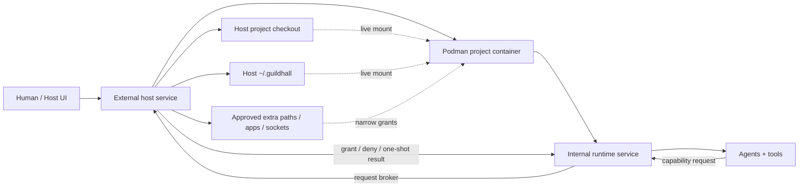

# Podman project runtime

**Status:** `0.8.0` exploration candidate

**Release scope:** use
`internal/plans/2026-05-24-guildhall-0-8-mvp-tracker.md` as the current 0.8.0
MVP source of truth. Podman/container runtime work is deferred to 0.9.0 or
later unless a narrow manual spike is needed to de-risk the next release.

This note captures a possible runtime direction for Guildhall: make the agent
execution environment a local Podman container instead of a long-running
Guildhall service that executes directly on the host.

The goal is not "containers because containers." The goal is to give agents a
boring, disposable Linux workspace where they can install packages, run system
commands, start dev servers, and make mistakes without turning the user's host
machine into the blast radius.

## Core Invariants

- The container is disposable. Guildhall memory is not.
- Durable Guildhall state, evidence, task history, artifacts, and logs live in
  host `~/.guildhall` from day one.
- Project source stays host-owned and live-mounted, so the user's editor,
  backups, and normal inspection workflow keep working.
- Agents run ordinary project commands inside the container by default.
- Anything outside the approved mounts or container boundary is a deliberate
  capability request.
- Extra directory access is a human-intervention moment, not an ambient agent
  privilege.
- The host UI remains the trust, approval, and evidence surface.

## Runtime Sketch

1. Guildhall boots a local Podman container.
2. The container installs or receives the internal Guildhall runtime service.
3. Guildhall mounts host `~/.guildhall` into the container.
4. When the user adds a project, Guildhall mounts that project live into the
   container.
5. Guildhall exposes approved container ports back to the host UI.
6. Agents run commands inside the container against the mounted project, while
   the host UI remains the control surface.

In this shape, "Guildhall service" becomes less important than "Guildhall
supervisor": the host app starts, stops, observes, and updates isolated project
runtimes.

## Default Image Bias

Start with Debian, probably a slim stable image.

That gives agents the least-surprising Linux target:

- glibc instead of musl;
- common package names and install docs;
- predictable shell/coreutils behavior;
- broad compatibility with Node, Python, Playwright, Git, and native build
  dependencies;
- fewer Alpine-specific edge cases for LLMs to reason around.

Alpine is attractive for size, but size is less important than reducing runtime
surprise. A tiny image that makes every install/debug loop stranger is the wrong
optimization for an agent workspace.

## Host And Container Split

The host should own:

- project registration and approvals;
- container lifecycle;
- port allocation and host URL routing;
- persistent Guildhall project state in `~/.guildhall`;
- display of logs, questions, artifacts, and review evidence;
- explicit permission controls for mounting paths, exposing ports, and granting
  host-side tools.

The container should own:

- tool installation;
- command execution;
- repo-local package installs;
- dev server processes;
- test/browser/runtime checks;
- disposable caches that can be rebuilt.

The mounted project and `~/.guildhall` should remain live bind mounts, not
copied snapshots, at least for the default local-development path. The user
should be able to inspect files, state, logs, and artifacts from the host while
the agent works, and normal editors should keep working.

The container should write nothing important only to its own ephemeral
filesystem. If deleting and recreating the container would lose meaningful
Guildhall state, evidence, project metadata, or user-authored work, the runtime
boundary is wrong.

## Runtime Topology



The host service is the trust boundary. The internal service is the work
boundary. Most work should stay internal; anything that touches the user's wider
machine crosses the host service deliberately.

## Tool Boundary

The tool boundary has two sides:

- **Internal runtime service:** runs inside the container and owns normal agent
  tools: shell, repo file access, package installs, project dev servers, tests,
  and container-local browser automation when available.
- **External host service:** runs on the host and owns host-only capabilities:
  adding directory mounts, opening host URLs, talking to OS apps, using keychain
  or credential helpers, accessing local daemons, brokering Docker/Podman socket
  access, and any file path outside the already granted mounts.

Agents should not get these external capabilities implicitly. They should ask
Guildhall for a specific capability, Guildhall should show the human what is
being requested, and the host service should grant only the approved mount,
socket, app, credential, port, or one-shot operation.

This is not just a low-level permission prompt. Extra directory access is one of
the places where Guildhall should deliberately bring the human into the loop.
The agent should explain what it needs, why the current project mount is not
enough, whether read-only access would work, and what happens if the user says
no.

## Internal Tool Surface

Agents inside the container get a normal internal tool surface by default:

- `shell.exec` against the mounted project;
- project file read/write within approved mounts;
- package-manager and test commands;
- dev-server lifecycle;
- container-local browser automation when a browser can run in the container;
- read/write access to mounted `~/.guildhall` state through Guildhall APIs, not
  by hand-editing arbitrary state files unless the task explicitly requires it.

## Capability Requests

When an agent needs something outside that boundary, it raises a capability
request instead of improvising. Directory access requests are human-intervention
events by default:

```json
{
  "type": "capability_request",
  "capability": "mount_directory",
  "reason": "Read the sibling design-system package used by this project",
  "requestedPath": "/Users/matthew/git/oss/design-system",
  "access": "read-only",
  "duration": "this-task"
}
```

The external host service evaluates and presents the request. If approved, it
performs the host-side action and gives the internal runtime a narrow handle:

- a new bind mount at a stable container path;
- a forwarded local port;
- a one-shot file picker result;
- a scoped credential helper token;
- a proxied browser session;
- a container-engine broker for project Compose/Podman operations;
- a host command result for a small allowlisted operation.

The internal agent sees the granted handle, not the whole host. That keeps the
execution model powerful without letting "just run it on the host" become the
default escape hatch.

This split also handles nested containers. A project that uses Docker Compose
should not automatically receive the host's container socket. The agent should
request a `container_engine` capability, and Guildhall can choose the safest
available implementation:

- run Compose through a host broker;
- provide a rootless Podman socket scoped to the project;
- use a remote builder;
- deny socket access and fall back to project-specific host instructions;
- explicitly mark the task blocked if the project requires privileges Guildhall
  cannot safely grant.

Every grant should be visible in Thread/task evidence and revocable at the
project level.

## Human Intervention Shape

For extra directory access, Thread should render the request like a normal
decision card, not like a browser permission toast:

- what the agent is trying to do;
- the exact host path requested;
- read-only vs read/write access, with read-only preferred;
- suggested narrower alternatives if Guildhall can infer them;
- how long the access will last;
- what will be recorded in project evidence;
- what fallback path the agent will take if denied.

The user actions should be explicit:

- approve read-only for this task;
- approve read/write for this task;
- choose a different directory;
- deny and ask the agent to continue another way.

That makes directory access part of Guildhall's human collaboration model: the
agent can ask for more context or reach, but the human decides when the boundary
expands.

## Capability Examples

- **Sibling repo:** request read-only mount of another checkout for API/schema
  comparison.
- **Generated artifact output:** request write access to a user-chosen export
  directory outside the project.
- **Browser on host:** request a proxied host browser when the task depends on
  macOS browser profile state, extensions, or SSO.
- **Keychain credential:** request a scoped credential lookup rather than
  mounting `~/.ssh`, `~/.aws`, or the whole home directory.
- **Local daemon:** request a typed call to a host service such as a database,
  simulator, or app-specific dev daemon.
- **Project Compose stack:** request a container-engine broker instead of
  blindly mounting `/var/run/docker.sock` or the Podman socket.

Default posture: ask for the smallest capability that would unblock the task,
grant it for the shortest useful duration, and record the decision.

## Host Service Responsibilities

- Maintain the project-to-container registry.
- Start, stop, rebuild, and inspect containers.
- Allocate and expose ports.
- Mount the project root and `~/.guildhall`.
- Add and remove approved extra directory mounts.
- Broker host-only tools and one-shot operations.
- Keep permission grants auditable and revocable.
- Surface denied or expired capabilities as task blockers, not vague tool
  failures.

## Internal Service Responsibilities

- Execute normal project commands inside the container.
- Keep task commands scoped to approved mounts.
- Route external needs through capability requests.
- Record command logs, environment diffs, cwd, port requests, and tool results.
- Avoid writing durable Guildhall state outside mounted `~/.guildhall`.
- Treat denied external capabilities as constraints to plan around.

## Runtime Refinements

- Treat each project as its own container by default. Shared containers create
  easier setup, but they also blend dependencies, ports, processes, and failure
  state across projects.
- Keep a named volume for durable agent caches if performance demands it, but
  keep source checkouts and `~/.guildhall` as explicit host bind mounts.
- Use a stable in-container mount layout, for example `/workspace/<project>`
  for the selected project and `/home/guildhall/.guildhall` for host-owned
  Guildhall state.
- Add a project-level runtime manifest later, with defaults first:
  `debian`, `node`, `python`, `playwright`, `git`, `rg`, and common build
  tools.
- Make port exposure explicit: the container can request ports, but the host
  allocator decides what gets exposed and how it maps to UI links.
- Make extra filesystem access an explicit runtime request. The agent can ask
  for `/Users/matthew/Documents/foo` or another repo, but the host service
  grants it as a new narrow mount only after a human approval in Thread and
  records why it was needed.
- Treat host-side operations as brokered tools, not ambient shell access. A
  browser, keychain lookup, local daemon call, or OS-specific app action should
  have a typed request/result record and a visible permission trail.
- Keep all command logs tagged with the container id, project id, cwd, env
  diff, and exposed port map so debugging does not become archaeology.
- Support "rebuild runtime" as a first-class recovery action.

## Concerns

- **macOS bind mounts:** Podman on macOS runs through a VM, so live mounts for
  both project source and `~/.guildhall` may have different file watching, path,
  permissions, and performance behavior than native host execution.
- **State ownership:** `~/.guildhall` must stay host-readable and portable. The
  container should run as a predictable user or map ids carefully so state files
  do not become awkwardly owned by a container-only uid.
- **Credentials:** Git remotes, package registries, cloud CLIs, and SSH keys
  need an explicit story. Blindly mounting the user's home directory would
  defeat most of the isolation.
- **Host integration:** agents sometimes need browser automation, OS-specific
  apps, keychains, local daemons, or files outside the project. Each escape hatch
  needs to be intentional.
- **Nested containers:** projects that already use Docker/Podman/Compose may
  need socket access, remote builders, or a clear "run this on host" fallback.
- **Resource controls:** long agent runs need CPU, memory, process, disk, and
  network limits that are visible in the UI.
- **Security boundary:** this is a containment layer, not a promise that
  untrusted code is safe. The UI should avoid implying stronger sandboxing than
  Podman plus the host VM actually provides.
- **Runtime drift:** if agents install tools imperatively, reproducing a failing
  run can get hard. Important runtime mutations should be logged, and stable
  images should be rebuildable from a known Dockerfile/Containerfile.

## Bind-Mount Mitigations

This is not really a Podman-only issue. Linux containers on macOS need a Linux
VM, whether the tool is Podman, Docker Desktop, Lima, Colima, or another
container runtime. The exact implementation differs, but host-to-VM file sharing
is the shared rough edge.

Mitigate it in the runtime design:

- Keep host bind mounts narrow and explicit: the project root and `~/.guildhall`,
  not the user's whole home directory.
- Keep important durable state on host mounts, but put hot disposable write
  paths in container storage or named volumes when possible: package caches,
  browser caches, build output, test temp directories, language tool caches, and
  downloaded SDKs.
- Teach project runtimes to redirect common cache paths away from the live host
  mount, for example `PNPM_HOME`, npm cache, pip cache, Playwright browsers,
  Cargo target/cache, and similar tool-specific directories.
- Prefer VM file-sharing backends with better macOS behavior when available.
  Docker Desktop has synchronized file shares for large repos; Lima can use
  `vz` plus `virtiofs` on modern macOS; Podman machine settings should be part
  of the spike rather than assumed harmless.
- Make file watching adaptive. Start with native watchers, detect missed events
  or known problematic mount modes, then fall back to polling with project-level
  controls instead of leaving dev servers silently stale.
- Keep ownership predictable. Run the container as a stable user and verify that
  files written through the project and `~/.guildhall` mounts remain easy to
  edit, delete, and back up from the host.
- Include a mount-health check in setup: create, edit, rename, delete, symlink,
  chmod, and watch a small file from both sides before trusting the runtime.
- Expose a "mount mode" diagnostic in the UI so performance or watcher failures
  point to the real substrate, not to a mysterious agent failure.

For `~/.guildhall`, the risk should be manageable because it should be durable
state and evidence, not a high-churn dependency/build directory. The project
source mount is the one that needs serious proof against real JavaScript,
Python, Rust, and browser-test workflows.

## Open Design Questions

- Should the external host service be the same process as the host UI, or a
  smaller privileged helper that the UI talks to?
- Which host capabilities are always human-approved, and which can be granted by
  saved project policy?
- Can `~/.guildhall` be mounted read/write safely while still discouraging
  agents from editing internal state files directly?
- Does each project need exactly one container, or should large projects have
  separate task containers sharing the same host state and project mount?
- What is the minimum credential story that supports real Git/package-manager
  work without mounting broad host secrets?
- What is the least-dangerous nested-container default for projects that already
  rely on Compose?

## 0.8.0 Candidate Slices

1. **Spike:** manually boot a Debian-based Podman container, install Guildhall,
   bind-mount one real project, expose the UI/API port, and run a real task.
2. **Container supervisor:** add a small host-side lifecycle layer for create,
   start, stop, inspect, logs, and port mapping.
3. **Project mount contract:** define the exact mounted path layout, writable
   locations, `~/.guildhall` mount, excluded host paths, and
   project-id-to-container mapping.
4. **Credential policy:** decide the first supported Git/package-auth path
   without mounting broad host secrets.
5. **Dev-server/browser proof:** prove a project dev server started in the
   container can be opened from the host UI and verified through browser tests.
6. **Recovery path:** expose rebuild, restart, logs, and "open shell" controls
   for failed containers.
7. **Mount-health proof:** run setup checks for host/container writes,
   ownership, symlinks, chmod, renames, deletes, and file-watch delivery on the
   selected runtime backend.
8. **Capability request proof:** implement a fake `mount_directory` request in
   Thread, approve it, grant a narrow read-only mount, and record the grant in
   task evidence.
9. **Host-tool broker proof:** route one host-only action, such as opening a
   host browser URL or checking a host daemon, through the external service
   instead of running arbitrary host shell.

## Current Bias

This is a promising direction. It fits Guildhall's product shape better than
letting agents run directly against the host forever: the host remains the
supervisor and evidence surface, while the messy execution world lives in a
replaceable Linux environment.

The important refinement is that "replaceable" applies to the container, not to
Guildhall's memory. `~/.guildhall` should be mounted from the host from day one,
so deleting the container is a recovery operation, not a data-loss event.

The biggest question is not whether containers are useful. They are. The
question is whether the bind-mount, credentials, and nested-dev-environment
stories are smooth enough on macOS to feel like a better default rather than a
new source of friction.
